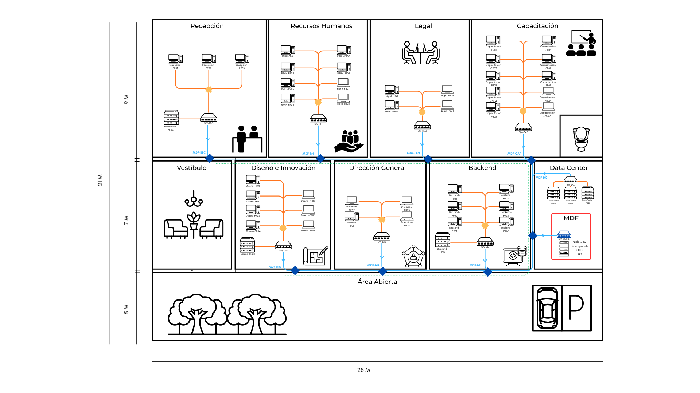
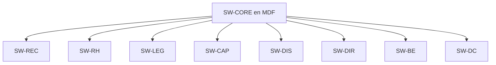

# Manual técnico de infraestructura física de red

## QuetzalDev S.A.

**Curso:** Redes de Computadoras 1  
**Práctica:** Diseño de infraestructura física de Capa 1  
**Estudiante:** Fernando Andhre Gonzalez Espinoza  
**Carné:** 202202055  
**Sección:** A
**Fecha:** 21/08/2026

---

## Índice

1. Introducción
2. Alcance y criterios de diseño
3. Distribución de dispositivos y puntos de red
4. Inventario de equipos y materiales
5. Ubicación y justificación del MDF
6. Topología física
7. Medios de transmisión
8. Distancias y cálculo de bobinas
9. Dimensionamiento de patch panels y switches
10. Cableado troncal
11. Canalización y nodos de derivación
12. Rack y gabinetes
13. Consumo eléctrico y UPS
14. Cables straight-through y crossover
15. Disposición de pines T568A y T568B
16. Etiquetado de cables
17. Comparación con ANSI/TIA-606-D
18. Flujo de conexión end-to-end
19. Presupuesto estimado
20. Escalabilidad futura
21. Compra de materiales o contratación de proveedor
22. Conclusiones
23. Referencias

---

## 1. Introducción

Este manual documenta el diseño físico de la red de QuetzalDev S.A. para un edificio corporativo de un solo nivel y dimensiones aproximadas de 28 m por 21 m. El alcance corresponde a la Capa 1 del modelo OSI; por lo tanto, se definen la ubicación de los equipos, los puntos de red, la topología física, los medios de transmisión, las rutas de canalización, las terminaciones, el etiquetado y el respaldo eléctrico. No se incluyen direcciones IP, VLAN, configuración de switches, protocolos de enrutamiento ni simulación.

La solución atiende 30 computadoras de escritorio, 12 laptops y 6 servidores, para un total de 48 dispositivos finales. Cada departamento cuenta con un switch de acceso y todos los switches departamentales se enlazan con un switch principal ubicado en el cuarto de telecomunicaciones o MDF.

El diagrama físico asociado debe almacenarse en el repositorio con el nombre DiagramaRedesPractica1.png.

---

## 2. Alcance y criterios de diseño

Los criterios aplicados fueron los siguientes:

- Mantener una topología sencilla, escalable y fácil de documentar.
- Evitar conexiones en cadena entre dispositivos finales.
- Utilizar un enlace independiente para cada punto de red.
- Diferenciar el cableado horizontal del cableado troncal.
- Mantener los cables UTP por debajo del límite de 90 m para el enlace permanente.
- Utilizar componentes Cat 6A en todo el canal de cobre para conservar la categoría extremo a extremo.
- Concentrar la administración principal en el MDF instalado dentro del Data Center.
- Proteger el troncal contra interferencia electromagnética mediante fibra óptica.
- Dejar puertos libres en switches, patch panels y ODF para ampliaciones futuras.
- Identificar tomas, cables, puertos, switches y nodos de derivación de forma consistente.

### 2.1 Supuestos técnicos

- Las laptops se conectan por Ethernet, directamente o mediante adaptador/base USB-C a RJ45. No se incluyen puntos de acceso inalámbricos porque la práctica se limita al diseño presentado.
- Cada switch departamental se instala en un gabinete de pared y se acompaña de un patch panel local.
- Los cables representados sobre una misma canalización son enlaces independientes. Los nodos de derivación no realizan empalmes eléctricos de Ethernet.
- Los precios son estimados en quetzales, incluyen referencias de mercado disponibles durante agosto de 2026 y deben confirmarse antes de una compra real.

---

## 3. Distribución de dispositivos y puntos de red

La distribución elegida respeta los totales de 30 PC, 12 laptops y 6 servidores.

| Departamento | PC | Laptops | Servidores | Puntos activos | Switch |
|---|---:|---:|---:|---:|---|
| Recepción | 3 | 0 | 1 | 4 | `SW-REC` |
| Recursos Humanos | 6 | 2 | 0 | 8 | `SW-RH` |
| Legal | 2 | 2 | 0 | 4 | `SW-LEG` |
| Capacitación | 8 | 2 | 0 | 10 | `SW-CAP` |
| Diseño e Innovación | 4 | 3 | 1 | 8 | `SW-DIS` |
| Dirección General | 1 | 3 | 0 | 4 | `SW-DIR` |
| Backend | 6 | 0 | 1 | 7 | `SW-BE` |
| Data Center | 0 | 0 | 3 | 3 | `SW-DC` |
| **Total** | **30** | **12** | **6** | **48** | **8 switches de acceso** |

### 3.1 Tipos de tomas de red

| Departamento | Tomas unitarias | Tomas dobles | Puertos en rack | Total de conectores RJ45 |
|---|---:|---:|---:|---:|
| Recepción | 4 | 0 | 0 | 4 |
| Recursos Humanos | 0 | 4 | 0 | 8 |
| Legal | 0 | 2 | 0 | 4 |
| Capacitación | 0 | 5 | 0 | 10 |
| Diseño e Innovación | 0 | 4 | 0 | 8 |
| Dirección General | 0 | 2 | 0 | 4 |
| Backend | 1 | 3 | 0 | 7 |
| Data Center | 0 | 0 | 3 | 3 |
| **Total** | **5** | **20** | **3** | **48** |

Las tomas de pared se instalarán aproximadamente entre 30 cm y 45 cm sobre el nivel del piso terminado, cerca del puesto de trabajo y sin quedar ocultas detrás de puertas o mobiliario fijo. Cuando una mesa se encuentre en el centro del salón, como en Capacitación, se utilizará una caja de piso o un descenso protegido desde el cielo falso.

---

## 4. Inventario de equipos y materiales

### 4.1 Equipo activo

| Cantidad | Equipo | Características mínimas | Función |
|---:|---|---|---|
| 1 | Switch principal `SW-CORE` | Administrable, al menos 16 puertos SFP/SFP+, montaje en rack | Concentrar los ocho enlaces troncales y permitir crecimiento |
| 8 | Switch departamental | Administrable, 16 puertos 10/100/1000 RJ45 y 2 ranuras SFP | Conectar los puntos locales y proporcionar un uplink óptico |
| 16 | Transceptores SFP 1000BASE-SX | Multimodo, 850 nm, conector LC | Dos módulos por cada uno de los ocho enlaces de fibra |
| 1 | UPS central | En línea, 1500 VA o superior, salida senoidal | Respaldar el equipo activo de red mediante circuitos protegidos |

### 4.2 Equipo pasivo y organización

| Cantidad | Elemento | Especificación propuesta | Función |
|---:|---|---|---|
| 8 | Patch panel local | Modular Cat 6A, 16 puertos | Terminar y ordenar el cableado horizontal de cada departamento |
| 1 | ODF central | 24 puertos LC | Terminar 16 fibras activas y reservar 8 fibras para crecimiento |
| 8 | Mini-ODF o caja óptica local | 2 a 4 puertos LC | Proteger la terminación de fibra en cada gabinete departamental |
| 1 | Rack de piso | 19 pulgadas, 24U, cuatro postes | Alojar `SW-CORE`, ODF, UPS, PDU y organizadores en el MDF |
| 8 | Gabinetes de pared | 19 pulgadas, 6U o superior | Alojar switch, patch panel y terminación óptica local |
| 1 | PDU de rack | 8 tomas o superior | Distribuir energía dentro del rack principal |
| 48 | Keystone RJ45 | Cat 6A | Terminar los 48 puntos de red |
| 5 | Faceplate unitaria | Un puerto | Tomas unitarias de Recepción y Backend |
| 20 | Faceplate doble | Dos puertos | Agrupar 40 puntos de red en puestos cercanos |
| 96 | Patch cords | Cat 6A prefabricados y certificados | 48 del dispositivo a la toma y 48 del patch panel al switch |
| 1 | Bobina UTP | Cat 6A, 23 AWG, 305 m | Cableado horizontal permanente |
| 8 | Enlaces ópticos | Fibra multimodo OM3 dúplex LC | Troncal entre MDF y switches departamentales |
| 15 | Cajas o nodos de derivación | Registrables y accesibles | Derivar canalizaciones sin empalmar cables de datos |
| 65 m | Escalerilla metálica cerrada | Con puesta a tierra y accesorios | Canalización troncal principal |
| 100 m | Canaleta secundaria | PVC de baja emisión de humo o equivalente | Distribución horizontal dentro de los departamentos |
| 1 lote | Organización y puesta a tierra | Organizadores, barra de tierra, etiquetas y fijaciones | Seguridad, administración y orden físico |

No se incluyen las PC, laptops ni servidores en el presupuesto porque el enunciado los presenta como dispositivos propiedad de la empresa.

---

## 5. Ubicación y justificación del MDF

El MDF se ubicó dentro del Data Center, en el extremo derecho del bloque de oficinas. Desde el punto de vista puramente geométrico, un cuarto ubicado entre Legal y Dirección General reduciría algunos metros de recorrido. Sin embargo, esa alternativa ocuparía un área operativa, expondría el equipo a tránsito de personal y dificultaría el control ambiental.

La ubicación dentro del Data Center se seleccionó por las siguientes razones:

1. **Seguridad física:** es un área con acceso restringido y menor exposición a golpes, manipulación accidental o robo.
2. **Condiciones ambientales:** permite controlar temperatura, ventilación, humedad y limpieza.
3. **Energía:** facilita centralizar el UPS, la PDU, la puesta a tierra y los circuitos protegidos.
4. **Mantenimiento:** concentra `SW-CORE`, ODF, organizadores y documentación en un solo rack.
5. **Distancia aceptable:** el edificio mide únicamente 28 m por 21 m y el enlace más largo es inferior a 30 m, muy por debajo de la capacidad de OM3 y del límite del cableado de cobre.
6. **Escalabilidad:** el rack de 24U y el ODF ofrecen espacio para nuevos enlaces, equipos de seguridad o un futuro router/firewall, aunque estos últimos no forman parte de la práctica.

La ruta principal sale del MDF, recorre el muro compartido entre los departamentos superiores e inferiores y utiliza derivaciones cortas hacia cada gabinete. Esta organización compensa la posición lateral del Data Center y evita recorridos innecesarios por el centro de las oficinas.

---

## 6. Topología física

### 6.1 Topología general

La topología general es una **estrella jerárquica o estrella extendida**. `SW-CORE` constituye el nivel principal; los ocho switches departamentales forman el segundo nivel; y las estaciones, laptops y servidores forman el nivel de acceso.

Aunque varios cables recorren la misma escalerilla, cada enlace MDF-switch es independiente. La línea compartida del diagrama representa la ruta física de canalización y no una topología bus.

### 6.2 Justificación por departamento

| Departamento | Topología local | Justificación |
|---|---|---|
| Recepción | Estrella simple | Cuatro dispositivos se conectan directamente a `SW-REC`. Es económica y una falla de un cable afecta solo a un punto. |
| Recursos Humanos | Estrella simple con canalización ramificada | Los ocho puntos se distribuyen en dos grupos de trabajo, pero cada cable regresa de forma independiente al patch panel y a `SW-RH`. Facilita mover puestos sin afectar a los demás. |
| Legal | Estrella simple | Los cuatro puntos requieren una solución sencilla y controlada. El switch actúa como único punto de concentración. |
| Capacitación | Estrella simple con dos ramas de canalización | Los diez puestos se agrupan físicamente por mesas. Dos rutas de canaleta reducen cruces, pero cada toma mantiene su enlace dedicado a `SW-CAP`. |
| Diseño e Innovación | Estrella simple | Los siete equipos y el servidor se conectan a `SW-DIS`. La independencia de enlaces favorece pruebas, transferencia de archivos y cambios de puestos. |
| Dirección General | Estrella simple | Cuatro puntos se concentran en `SW-DIR`, con mantenimiento sencillo y mínimo impacto ante una falla individual. |
| Backend | Estrella simple | Las seis PC y el servidor mantienen enlaces dedicados. La fibra hacia el MDF evita que el tráfico troncal dependa del cableado de cobre de otro departamento. |
| Data Center | Estrella de servidores | Los tres servidores se conectan directamente a `SW-DC`, alojado en rack. El switch se conecta a `SW-CORE` con fibra y no se encadenan servidores. |

La estrella fue seleccionada en todos los segmentos activos porque el enunciado exige un switch por departamento. Utilizar bus o anillo obligaría a compartir el medio o encadenar equipos, reduciendo disponibilidad y complicando el mantenimiento. Las diferencias entre áreas se resuelven mediante el número y tipo de tomas, la distribución de canalización y la reserva de puertos.

---

## 7. Medios de transmisión

| Segmento | Extremos | Medio | Categoría/tipo | Velocidad propuesta | Justificación |
|---|---|---|---|---|---|
| Horizontal de usuario | Toma/patch panel local - switch departamental | Par trenzado de cobre | UTP Cat 6A, 23 AWG | 1 Gb/s inicialmente; capacidad de 10 Gb/s en canal compatible | Es económico, fácil de terminar, compatible con RJ45 y suficiente para las distancias internas |
| Patch cord de usuario | PC/laptop/servidor - toma | Cobre flexible | Cat 6A certificado | Igual al enlace horizontal | Mantiene la categoría completa del canal y evita fabricar latiguillos en campo |
| Patch cord de gabinete | Patch panel - switch | Cobre flexible | Cat 6A certificado | Igual al enlace horizontal | Permite cambios de puerto sin modificar el cable permanente |
| Troncal departamental | Switch departamental - MDF | Fibra óptica | OM3 multimodo, 50/125 µm, LC dúplex | 1 Gb/s con SFP SX; preparada para 10 Gb/s con SFP+ | Inmunidad a interferencias, aislamiento eléctrico y capacidad de crecimiento |
| Terminación óptica | ODF/mini-ODF - transceptor | Fibra óptica | Patch cord OM3 LC-LC dúplex | Igual al troncal | Protege y organiza las fibras evitando dobleces o manipulación directa |

La fibra OM3 admite 10 Gigabit Ethernet hasta 300 m según especificaciones de fabricante, mientras que el enlace más largo de este edificio es menor de 30 m. Esto proporciona un margen amplio para pérdidas, reorganización de ruta y futuras actualizaciones. Véase la especificación técnica de [Corning para OM3](https://ecatalog.corning.com/optical-communications/IN/en/Fiber-Optic-Cable-Assemblies/Indoor-Cable-Assemblies/Two-Fiber-Indoor-Cable-Assemblies/Professional-2-0-mm-2-Fiber-Patch-Cord/p/050502T5Z20003M).

---

## 8. Distancias y cálculo de bobinas

### 8.1 Metodología

Las distancias se estimaron a partir de las dimensiones de 28 m por 21 m del plano. Para cada punto se consideró un recorrido ortogonal por muro, canaleta o cielo falso hasta el gabinete departamental, incluyendo ascensos y descensos. No se utilizó una línea diagonal directa.

Los valores son estimaciones de diseño y deben confirmarse mediante levantamiento físico antes de comprar o cortar cable.

### 8.2 Cableado horizontal UTP Cat 6A

| Departamento | Punto | Dispositivo | Distancia estimada (m) |
|---|---|---|---:|
| Recepción | `Recepcion-PR01` | PC 1 | 6.0 |
| Recepción | `Recepcion-PR02` | PC 2 | 5.0 |
| Recepción | `Recepcion-PR03` | PC 3 | 6.0 |
| Recepción | `Recepcion-PR04` | Servidor | 3.0 |
| Recursos Humanos | `RRHH-PR01` | PC 1 | 7.0 |
| Recursos Humanos | `RRHH-PR02` | PC 2 | 6.0 |
| Recursos Humanos | `RRHH-PR03` | PC 3 | 5.0 |
| Recursos Humanos | `RRHH-PR04` | PC 4 | 4.0 |
| Recursos Humanos | `RRHH-PR05` | PC 5 | 7.0 |
| Recursos Humanos | `RRHH-PR06` | PC 6 | 6.0 |
| Recursos Humanos | `RRHH-PR07` | Laptop 1 | 5.0 |
| Recursos Humanos | `RRHH-PR08` | Laptop 2 | 4.0 |
| Legal | `Legal-PR01` | PC 1 | 5.0 |
| Legal | `Legal-PR02` | PC 2 | 4.0 |
| Legal | `Legal-PR03` | Laptop 1 | 5.0 |
| Legal | `Legal-PR04` | Laptop 2 | 4.0 |
| Capacitación | `Capacitacion-PR01` | PC 1 | 7.0 |
| Capacitación | `Capacitacion-PR02` | PC 2 | 6.5 |
| Capacitación | `Capacitacion-PR03` | PC 3 | 6.0 |
| Capacitación | `Capacitacion-PR04` | PC 4 | 5.5 |
| Capacitación | `Capacitacion-PR05` | PC 5 | 5.0 |
| Capacitación | `Capacitacion-PR06` | PC 6 | 7.0 |
| Capacitación | `Capacitacion-PR07` | PC 7 | 6.5 |
| Capacitación | `Capacitacion-PR08` | PC 8 | 6.0 |
| Capacitación | `Capacitacion-PR09` | Laptop 1 | 5.5 |
| Capacitación | `Capacitacion-PR10` | Laptop 2 | 5.0 |
| Diseño e Innovación | `Diseno-PR01` | PC 1 | 6.0 |
| Diseño e Innovación | `Diseno-PR02` | PC 2 | 5.5 |
| Diseño e Innovación | `Diseno-PR03` | PC 3 | 5.0 |
| Diseño e Innovación | `Diseno-PR04` | PC 4 | 4.5 |
| Diseño e Innovación | `Diseno-PR05` | Laptop 1 | 6.0 |
| Diseño e Innovación | `Diseno-PR06` | Laptop 2 | 5.5 |
| Diseño e Innovación | `Diseno-PR07` | Laptop 3 | 5.0 |
| Diseño e Innovación | `Diseno-PR08` | Servidor | 3.0 |
| Dirección General | `Direccion-PR01` | PC 1 | 4.0 |
| Dirección General | `Direccion-PR02` | Laptop 1 | 5.0 |
| Dirección General | `Direccion-PR03` | Laptop 2 | 5.0 |
| Dirección General | `Direccion-PR04` | Laptop 3 | 4.0 |
| Backend | `Backend-PR01` | PC 1 | 4.0 |
| Backend | `Backend-PR02` | PC 2 | 5.0 |
| Backend | `Backend-PR03` | PC 3 | 6.0 |
| Backend | `Backend-PR04` | PC 4 | 5.0 |
| Backend | `Backend-PR05` | PC 5 | 4.0 |
| Backend | `Backend-PR06` | PC 6 | 3.5 |
| Backend | `Backend-PR07` | Servidor | 3.0 |
| Data Center | `DataCenter-PR01` | Servidor 1 | 2.5 |
| Data Center | `DataCenter-PR02` | Servidor 2 | 2.0 |
| Data Center | `DataCenter-PR03` | Servidor 3 | 2.5 |

### 8.3 Resumen de UTP por departamento

| Departamento | Puntos | Subtotal UTP (m) |
|---|---:|---:|
| Recepción | 4 | 20.0 |
| Recursos Humanos | 8 | 44.0 |
| Legal | 4 | 18.0 |
| Capacitación | 10 | 60.0 |
| Diseño e Innovación | 8 | 40.5 |
| Dirección General | 4 | 18.0 |
| Backend | 7 | 30.5 |
| Data Center | 3 | 7.0 |
| **Subtotal** | **48** | **238.0** |

> Nota de control: la suma de las distancias individuales es 238.0 m. Las cifras se redondearon a incrementos de 0.5 m.

Se agrega 15 % por holgura de terminación, ascensos, curvas, mantenimiento y desperdicio:

\[
L_{UTP}=238.0\text{ m}\times1.15=273.7\text{ m}
\]

Para bobinas estándar de 305 m:

\[
N=\left\lceil\frac{273.7}{305}\right\rceil=1\text{ bobina}
\]

**Resultado:** se requiere una bobina Cat 6A de 305 m. Quedarían aproximadamente 31.3 m de reserva. Los patch cords no se descuentan de esta bobina porque se adquirirán prefabricados y certificados.

### 8.4 Distancias del troncal OM3

| Enlace | Distancia base (m) | Con 15 % de reserva (m) | Longitud comercial propuesta |
|---|---:|---:|---:|
| `MDF-Recepcion` | 26 | 29.9 | 30 m |
| `MDF-RRHH` | 20 | 23.0 | 25 m |
| `MDF-Legal` | 14 | 16.1 | 20 m |
| `MDF-Capacitacion` | 8 | 9.2 | 10 m |
| `MDF-Diseno` | 22 | 25.3 | 30 m |
| `MDF-Direccion` | 16 | 18.4 | 20 m |
| `MDF-Backend` | 9 | 10.4 | 15 m |
| `MDF-DataCenter` | 3 | 3.5 | 5 m |
| **Total** | **118** | **135.7** | **155 m adquiridos** |

Se propone adquirir ocho enlaces OM3 LC-LC preterminados en longitudes comerciales. La compra preterminada reduce el riesgo y el costo de fusionar fibra en obra. La reserva adicional queda organizada dentro de los gabinetes respetando el radio de curvatura.

---

## 9. Dimensionamiento de patch panels y switches

### 9.1 Dimensionamiento local

Se estandariza cada gabinete departamental con un switch de 16 puertos RJ45 y un patch panel modular de 16 posiciones. Esta decisión simplifica repuestos y documentación, además de satisfacer que la capacidad del switch sea igual o mayor a la del patch panel correspondiente.

| Departamento | Puntos activos | Patch panel | Switch RJ45 | Puertos RJ45 libres |
|---|---:|---:|---:|---:|
| Recepción | 4 | 16 posiciones | 16 | 12 |
| Recursos Humanos | 8 | 16 posiciones | 16 | 8 |
| Legal | 4 | 16 posiciones | 16 | 12 |
| Capacitación | 10 | 16 posiciones | 16 | 6 |
| Diseño e Innovación | 8 | 16 posiciones | 16 | 8 |
| Dirección General | 4 | 16 posiciones | 16 | 12 |
| Backend | 7 | 16 posiciones | 16 | 9 |
| Data Center | 3 | 16 posiciones | 16 | 13 |
| **Total** | **48** | **128 posiciones** | **128 puertos** | **80 libres** |

Solo se instalarán inicialmente 48 keystones. Las posiciones libres se conservarán tapadas para evitar polvo y permitir crecimiento.

### 9.2 Dimensionamiento del MDF

`SW-CORE` requiere ocho puertos ópticos activos, uno por switch departamental. Se selecciona un equipo con al menos 16 puertos SFP/SFP+, de modo que se utilice el 50 % y queden ocho puertos para nuevos gabinetes o enlaces redundantes.

El ODF central será de 24 puertos LC. Cada enlace dúplex utiliza dos fibras, por lo que ocho enlaces ocupan 16 puertos ópticos y quedan ocho puertos libres, equivalentes a cuatro enlaces dúplex adicionales.

El switch principal no necesita 48 puertos RJ45 porque los 48 dispositivos no llegan directamente al MDF: terminan en los ocho switches departamentales. El requisito de capacidad se satisface en cada pareja patch panel-switch local, mientras que el MDF se dimensiona de acuerdo con los ocho uplinks ópticos.

### 9.3 Justificación de los elementos

- **Switches administrables:** permiten supervisión, diagnóstico, control de errores y futuras funciones de segmentación, aunque su configuración queda fuera de esta práctica.
- **Patch panels:** evitan terminar el cable permanente directamente en el switch y permiten reorganizar puertos mediante patch cords.
- **ODF y mini-ODF:** protegen conectores y reservas de fibra, mantienen radios de curvatura y facilitan identificación.
- **Transceptores SFP:** convierten la interfaz eléctrica del switch en una interfaz óptica compatible con OM3.
- **Rack y gabinetes:** protegen los equipos, mantienen el orden y restringen la manipulación.
- **UPS y PDU:** estabilizan y distribuyen energía para conservar la operación ante perturbaciones o cortes breves.

---

## 10. Cableado troncal

El troncal conecta `SW-CORE` con `SW-REC`, `SW-RH`, `SW-LEG`, `SW-CAP`, `SW-DIS`, `SW-DIR`, `SW-BE` y `SW-DC`. Cada enlace utiliza fibra multimodo OM3 dúplex con conectores LC y dos transceptores 1000BASE-SX.

### 10.1 Justificación de OM3

1. **Inmunidad electromagnética:** no capta interferencia de luminarias, motores, UPS ni alimentación eléctrica.
2. **Aislamiento eléctrico:** evita diferencias de potencial entre gabinetes departamentales y el MDF.
3. **Capacidad futura:** el cable instalado puede reutilizarse para 10 Gb/s al cambiar los módulos SFP por SFP+ y utilizar switches compatibles.
4. **Distancia:** todos los enlaces son muy inferiores a los 300 m soportados por OM3 para 10 Gigabit Ethernet.
5. **Orden:** el uso de ODF y conectores LC permite una administración clara en el rack.

El costo inicial es superior al de un troncal UTP, pero evita reemplazar el medio cuando aumente el tráfico entre servidores, Backend, Diseño y el Data Center. La fibra tampoco se clasifica como cable directo o cruzado; se administra mediante polaridad óptica transmisor-receptor.

---

## 11. Canalización y nodos de derivación

### 11.1 Canalización principal

Se propone una **escalerilla metálica cerrada** sobre el cielo falso para la ruta principal. La cubierta protege los cables del polvo, manipulación, objetos que pudieran caer y daños accidentales. La escalerilla contará con puesta a tierra, soportes, curvas y registros accesibles.

La ruta parte del MDF, recorre los muros de circulación y se deriva hacia cada gabinete. La fibra y el cobre se organizarán en secciones separadas o mediante divisor. La canalización de telecomunicaciones se mantendrá separada de la energía; cuando sea indispensable cruzarla, el cruce se realizará a 90 grados.

### 11.2 Canalización secundaria

Dentro de cada departamento se utiliza canaleta cerrada de PVC o material de baja emisión de humo. Las derivaciones hacia tomas dobles o unitarias se realizan mediante accesorios del mismo sistema, evitando cables expuestos.

### 11.3 Nodos de derivación

Los nodos marcados en el diagrama representan cajas registrables donde se separan rutas de canalización. No son empalmes de Ethernet. Cada cable Cat 6A debe continuar completo desde la toma hasta el patch panel.

Se contemplan aproximadamente quince nodos:

- Ocho nodos principales para derivar desde la canalización troncal hacia los departamentos.
- Siete nodos secundarios para distribuir el cableado horizontal en Recepción, Recursos Humanos, Legal, Capacitación, Diseño, Dirección y Backend.

Las cajas deben quedar accesibles, preferentemente sobre el cielo falso o en la parte alta del muro, y nunca detrás de mobiliario fijo.

---

## 12. Rack y gabinetes

### 12.1 Rack del MDF

Se selecciona un rack de piso de 19 pulgadas, cuatro postes y 24U. Un gabinete pequeño de pared no sería apropiado porque debe alojar:

| Elemento | Espacio aproximado |
|---|---:|
| ODF | 1U |
| Switch principal | 1U |
| Organizadores horizontales | 2U |
| PDU/gestión de energía | 1U o montaje vertical |
| UPS | 2U a 4U según modelo |
| Bandejas y reserva | 2U |
| Espacio para crecimiento y ventilación | 8U o más |

El rack de 24U permite orden, ventilación, puesta a tierra y crecimiento. Se fijará al piso y se ubicará de manera que exista acceso frontal y posterior para mantenimiento.

### 12.2 Gabinetes departamentales

Cada área tendrá un gabinete de pared de 6U o superior con cerradura. Contendrá el patch panel de 16 posiciones, el switch departamental, el mini-ODF, un organizador y una pequeña PDU. La ubicación recomendada es alta y cercana a la pared que limita con la ruta principal, fuera del alcance del público y sin bloquear ventilación.

---

## 13. Consumo eléctrico y capacidad de UPS

### 13.1 Estimación de consumo

| Equipo | Cantidad | Consumo estimado unitario | Subtotal |
|---|---:|---:|---:|
| Switch principal | 1 | 60 W | 60 W |
| Switch departamental sin PoE | 8 | 13 W | 104 W |
| Transceptor SFP | 16 | 1 W | 16 W |
| **Carga activa estimada** |  |  | **180 W** |

Patch panels, ODF, rack y organizadores son pasivos y no consumen energía.

Se agrega 30 % de margen:

\[
P_{diseño}=180\text{ W}\times1.30=234\text{ W}
\]

Suponiendo un factor de potencia de 0.9:

\[
S=\frac{234\text{ W}}{0.9}=260\text{ VA}
\]

### 13.2 UPS seleccionado

Se recomienda un UPS en línea de **1500 VA**, con una capacidad real mínima cercana a 900 W. La carga de diseño de 234 W representa aproximadamente el 26 % de una salida de 900 W, dejando margen para pérdidas, envejecimiento de baterías y equipos adicionales.

El diseño supone que los ocho gabinetes reciben alimentación desde circuitos dedicados respaldados por el UPS del MDF. Si la instalación eléctrica no permite esta distribución, cada gabinete deberá incorporar un UPS local de 600 VA y el UPS central respaldará únicamente `SW-CORE`, ODF activo si existiera y equipos del MDF.

Los servidores no se incluyen en este cálculo porque el requerimiento solicita estimar el equipo activo de red. Los servidores necesitan un estudio eléctrico y UPS independiente según su potencia real.

---

## 14. Cables straight-through y crossover

### 14.1 Enlaces instalados

| Segmento | Etiquetas | Cantidad | Tipo | Justificación |
|---|---|---:|---|---|
| Recepción | `Recepcion-PR01` a `Recepcion-PR04` | 4 | Straight-through T568B-B | Dispositivo final a switch, equipos de distinto tipo |
| Recursos Humanos | `RRHH-PR01` a `RRHH-PR08` | 8 | Straight-through T568B-B | PC/laptop a switch |
| Legal | `Legal-PR01` a `Legal-PR04` | 4 | Straight-through T568B-B | PC/laptop a switch |
| Capacitación | `Capacitacion-PR01` a `Capacitacion-PR10` | 10 | Straight-through T568B-B | PC/laptop a switch |
| Diseño e Innovación | `Diseno-PR01` a `Diseno-PR08` | 8 | Straight-through T568B-B | PC/laptop/servidor a switch |
| Dirección General | `Direccion-PR01` a `Direccion-PR04` | 4 | Straight-through T568B-B | PC/laptop a switch |
| Backend | `Backend-PR01` a `Backend-PR07` | 7 | Straight-through T568B-B | PC/servidor a switch |
| Data Center | `DataCenter-PR01` a `DataCenter-PR03` | 3 | Straight-through T568B-B | Servidor a switch |
| Troncales | `MDF-Recepcion` a `MDF-DataCenter` | 8 | No aplica: fibra OM3 | La fibra utiliza polaridad LC dúplex, no T568A/B |
| Referencia didáctica | Switch legado - switch legado | No instalado | Crossover T568A-B | Se usaría entre dispositivos del mismo tipo sin Auto MDI-X |

Todos los 48 cables horizontales se poncharán con T568B en la toma y en el patch panel. Los patch cords también serán directos. En equipos modernos Auto MDI-X suele corregir automáticamente el cruce, pero el tipo físico se documenta para demostrar el criterio de Capa 1. Cisco explica la relación entre dispositivos MDI/MDI-X y cables directos o cruzados en [Fundamentos del cableado Ethernet](https://learningnetwork.cisco.com/s/blogs/a0D6e00000soIs9EAE/the-fundamentals-of-ethernet-cabling-in-an-enterprise-data-network).

---

## 15. Disposición de pines T568A y T568B

### 15.1 Orden de colores

| Pin | T568A | T568B |
|---:|---|---|
| 1 | Blanco/verde | Blanco/naranja |
| 2 | Verde | Naranja |
| 3 | Blanco/naranja | Blanco/verde |
| 4 | Azul | Azul |
| 5 | Blanco/azul | Blanco/azul |
| 6 | Naranja | Verde |
| 7 | Blanco/café | Blanco/café |
| 8 | Café | Café |

### 15.2 Cable directo o straight-through

El cable directo utiliza el mismo estándar en ambos extremos. El proyecto utiliza T568B-B:

| Pin extremo 1 T568B | Color | Pin extremo 2 T568B |
|---:|---|---:|
| 1 | Blanco/naranja | 1 |
| 2 | Naranja | 2 |
| 3 | Blanco/verde | 3 |
| 4 | Azul | 4 |
| 5 | Blanco/azul | 5 |
| 6 | Verde | 6 |
| 7 | Blanco/café | 7 |
| 8 | Café | 8 |

### 15.3 Cable cruzado o crossover

El cable cruzado de referencia utiliza T568A en un extremo y T568B en el otro. Los pares de transmisión y recepción tradicionales 1-2 y 3-6 quedan cruzados.

| Pin extremo T568A | Color en T568A | Pin funcional en extremo T568B | Color en T568B |
|---:|---|---:|---|
| 1 | Blanco/verde | 3 | Blanco/verde |
| 2 | Verde | 6 | Verde |
| 3 | Blanco/naranja | 1 | Blanco/naranja |
| 4 | Azul | 4 | Azul |
| 5 | Blanco/azul | 5 | Blanco/azul |
| 6 | Naranja | 2 | Naranja |
| 7 | Blanco/café | 7 | Blanco/café |
| 8 | Café | 8 | Café |

El crossover se documenta como evidencia académica, pero no se instala en el diseño porque los enlaces entre switches son ópticos.

---

## 16. Etiquetado de cables

### 16.1 Códigos de área

| Área | Código corto |
|---|---|
| Recepción | `REC` |
| Recursos Humanos | `RH` |
| Legal | `LEG` |
| Capacitación | `CAP` |
| Diseño e Innovación | `DIS` |
| Dirección General | `DIR` |
| Backend | `BE` |
| Data Center | `DC` |

### 16.2 Cableado horizontal

El formato obligatorio es `[Área]-PR##`. La misma etiqueta se instalará en la faceplate, en ambos extremos del cable y en el puerto del patch panel.

| Departamento | Rango de etiquetas | Asignación |
|---|---|---|
| Recepción | `Recepcion-PR01` a `Recepcion-PR03` | PC 1 a PC 3 |
| Recepción | `Recepcion-PR04` | Servidor de Recepción |
| Recursos Humanos | `RRHH-PR01` a `RRHH-PR06` | PC 1 a PC 6 |
| Recursos Humanos | `RRHH-PR07` a `RRHH-PR08` | Laptop 1 y Laptop 2 |
| Legal | `Legal-PR01` a `Legal-PR02` | PC 1 y PC 2 |
| Legal | `Legal-PR03` a `Legal-PR04` | Laptop 1 y Laptop 2 |
| Capacitación | `Capacitacion-PR01` a `Capacitacion-PR08` | PC 1 a PC 8 |
| Capacitación | `Capacitacion-PR09` a `Capacitacion-PR10` | Laptop 1 y Laptop 2 |
| Diseño e Innovación | `Diseno-PR01` a `Diseno-PR04` | PC 1 a PC 4 |
| Diseño e Innovación | `Diseno-PR05` a `Diseno-PR07` | Laptop 1 a Laptop 3 |
| Diseño e Innovación | `Diseno-PR08` | Servidor de Diseño |
| Dirección General | `Direccion-PR01` | PC 1 |
| Dirección General | `Direccion-PR02` a `Direccion-PR04` | Laptop 1 a Laptop 3 |
| Backend | `Backend-PR01` a `Backend-PR06` | PC 1 a PC 6 |
| Backend | `Backend-PR07` | Servidor de Backend |
| Data Center | `DataCenter-PR01` a `DataCenter-PR03` | Servidores principales 1 a 3 |

### 16.3 Cableado troncal

| Etiqueta | Origen | Destino |
|---|---|---|
| `MDF-Recepcion` | `SW-CORE`/ODF | `SW-REC` |
| `MDF-RRHH` | `SW-CORE`/ODF | `SW-RH` |
| `MDF-Legal` | `SW-CORE`/ODF | `SW-LEG` |
| `MDF-Capacitacion` | `SW-CORE`/ODF | `SW-CAP` |
| `MDF-Diseno` | `SW-CORE`/ODF | `SW-DIS` |
| `MDF-Direccion` | `SW-CORE`/ODF | `SW-DIR` |
| `MDF-Backend` | `SW-CORE`/ODF | `SW-BE` |
| `MDF-DataCenter` | `SW-CORE`/ODF | `SW-DC` |

### 16.4 Etiquetas complementarias

| Elemento | Formato | Ejemplo |
|---|---|---|
| Switch | `SW-[Código]` | `SW-BE` |
| Nodo de derivación | `ND-[Código]-##` | `ND-CAP-02` |
| Patch panel | `PP-[Código]-##` | `PP-RH-01` |
| Puerto de patch panel | `PP-[Código]-P##` | `PP-RH-P01` |
| Computadora | `PC-[Código]-##` | `PC-REC-01` |
| Laptop | `LT-[Código]-##` | `LT-DIR-02` |
| Servidor | `SRV-[Código]-##` | `SRV-DC-01` |

---

## 17. Comparación con ANSI/TIA-606-D

ANSI/TIA-606-D es el estándar publicado para la administración de infraestructura de telecomunicaciones. TIA indica que estos estándares abarcan identificación y administración de cableado, espacios y rutas en edificios y centros de datos. La TIA incluye ANSI/TIA-606-D entre sus estándares de infraestructura vigentes en su documentación pública: [TIA, estándares para infraestructura de telecomunicaciones](https://tiaonline.org/how-broadband-workforce-development-and-standards-drive-data-center-growth/).

| Aspecto | Esquema simplificado de la práctica | Enfoque ANSI/TIA-606-D |
|---|---|---|
| Alcance del identificador | Usa área y número de punto, por ejemplo `Recepcion-PR01` | Utiliza identificadores únicos vinculados con edificio, espacio, rack, panel, puerto, cable y terminación |
| Registros | El diagrama y una tabla muestran las conexiones | Exige una administración estructurada de identificadores, registros y relaciones entre componentes |
| Rutas y espacios | Solo se muestran MDF, departamentos y canalizaciones principales | Se administran formalmente cuartos, gabinetes, rutas, canalizaciones, enlaces y ubicaciones |
| Cambios | No se documenta historial de altas, bajas o movimientos | Permite mantener registros de movimientos, adiciones, cambios, pruebas y mantenimiento |
| Colores | Los colores distinguen visualmente cobre, fibra y canalización | La codificación puede formar parte de una política completa y consistente de administración |

### 17.1 Diferencias concretas

1. `Recepcion-PR01` es único dentro del plano, pero no identifica por sí solo el gabinete, patch panel y puerto donde termina. Un sistema completo relacionaría el punto con todos esos elementos.
2. La práctica utiliza una tabla estática, mientras que un entorno real necesita registros actualizados de pruebas, responsables, cambios y estado de cada enlace.
3. El esquema simplificado no codifica de forma completa edificios, cuartos, racks ni rutas; ANSI/TIA-606-D busca administrar esos componentes como parte de un sistema integral.

En un entorno real se utilizaría el estándar completo porque reduce errores durante incidentes, permite localizar ambos extremos de un cable sin seguirlo físicamente, conserva el historial de mantenimiento y evita duplicidad de nombres cuando existen varios pisos, racks o edificios.

---

## 18. Flujo de conexión end-to-end

El flujo físico de `PC-REC-01` hacia la infraestructura central es el siguiente:

1. La tarjeta Ethernet de `PC-REC-01` se conecta mediante un patch cord Cat 6A a la toma `Recepcion-PR01`.
2. La toma termina el cable horizontal permanente Cat 6A.
3. El cable atraviesa canaleta y nodos de derivación sin empalmes.
4. El cable termina en el puerto 1 del patch panel `PP-REC-01`.
5. Un patch cord Cat 6A conecta el puerto del patch panel con el puerto 1 de `SW-REC`.
6. `SW-REC` utiliza un transceptor SFP y fibra OM3 dúplex identificada como `MDF-Recepcion`.
7. La fibra termina en el mini-ODF departamental y en el ODF central del MDF, conservando la polaridad transmisor-receptor.
8. Un patch cord óptico OM3 conecta el ODF con un puerto SFP de `SW-CORE`.
9. Desde `SW-CORE`, el tráfico puede salir por otro enlace troncal hacia el switch donde se encuentre el dispositivo de destino.

El mismo principio se aplica a laptops y servidores. Cada dispositivo mantiene un enlace horizontal independiente hasta su switch local.

---

## 19. Presupuesto estimado

Los precios son referenciales en quetzales y pueden cambiar por marca, disponibilidad, importación e impuestos. No constituyen una cotización comercial.

| Cantidad | Descripción | Precio unitario estimado | Subtotal |
|---:|---|---:|---:|
| 8 | Switch administrable 16 RJ45 + 2 SFP | Q1,220.00 | Q9,760.00 |
| 1 | Switch principal con al menos 16 SFP/SFP+ | Q15,407.00 | Q15,407.00 |
| 16 | Transceptor SFP multimodo LC | Q350.00 | Q5,600.00 |
| 8 | Patch panel modular Cat 6A de 16 puertos | Q500.00 | Q4,000.00 |
| 1 | ODF central de 24 puertos LC | Q2,200.00 | Q2,200.00 |
| 8 | Mini-ODF/caja de terminación óptica | Q350.00 | Q2,800.00 |
| 1 | Rack de piso 24U, cuatro postes | Q3,962.00 | Q3,962.00 |
| 8 | Gabinete de pared 6U | Q950.00 | Q7,600.00 |
| 1 | UPS en línea de 1500 VA | Q6,241.00 | Q6,241.00 |
| 1 | PDU para rack | Q450.00 | Q450.00 |
| 1 | Bobina UTP Cat 6A de 305 m | Q3,119.00 | Q3,119.00 |
| 155 m | Fibra OM3 dúplex preterminada | Q25.00/m | Q3,875.00 |
| 48 | Keystone RJ45 Cat 6A | Q55.00 | Q2,640.00 |
| 5 | Faceplate unitaria | Q20.00 | Q100.00 |
| 20 | Faceplate doble | Q30.00 | Q600.00 |
| 96 | Patch cord Cat 6A | Q35.00 | Q3,360.00 |
| 15 | Caja/nodo de derivación | Q75.00 | Q1,125.00 |
| 65 m | Escalerilla metálica cerrada y accesorios | Q120.00/m | Q7,800.00 |
| 100 m | Canaleta secundaria y accesorios | Q25.00/m | Q2,500.00 |
| 1 lote | Organizadores, puesta a tierra, etiquetas y consumibles | Q2,200.00 | Q2,200.00 |
| 1 servicio | Instalación y terminación | Q8,500.00 | Q8,500.00 |
| 1 servicio | Pruebas y certificación | Q3,000.00 | Q3,000.00 |
|  | **Subtotal** |  | **Q96,839.00** |
|  | Contingencia 10 % |  | Q9,683.90 |
|  | **Total estimado** |  | **Q106,522.90** |

### 19.1 Referencias de precios

- Como referencia, una bobina Cat 6A de 305 m se publicó alrededor de Q3,119: [Pacifiko, bobina Cat 6A](https://www.pacifiko.com/compras-en-linea/nexxt-solution-cable-utp-cat6a-color-gris-305-metros%26pid%3DYjkzNWRlMm).
- Un switch administrable de 16 puertos Gigabit y dos SFP se publicó alrededor de Q1,220: [Kemik, switch administrable](https://www.kemik.gt/tp-link-switch-administrable-16-puertos-gigabit-2-puertos-sfp).
- Un rack de cuatro postes y 24U se publicó alrededor de Q3,962: [Chipcom, racks abiertos](https://chipcom.com.gt/categorias/cableado-estructurado/racks-y-gabinetes/racks-abiertos).
- Un UPS en línea de 1500 VA se publicó en oferta alrededor de Q6,241: [Conectividad, UPS en línea](https://conectividad.com.gt/ups-en-linea/page/2/).
- Como referencia de gama empresarial, un switch con 16 interfaces SFP se publicó alrededor de Q15,407: [Chipcom, switch de agregación](https://www.chipcom.com.gt/producto/SGS-6341-16S8C4XR-PLANET-188668).

---

## 20. Escalabilidad futura

- Los switches y patch panels ofrecen 128 posiciones RJ45, de las cuales se utilizan 48; quedan 80 posiciones físicas disponibles.
- `SW-CORE` utiliza ocho de 16 puertos ópticos, dejando ocho disponibles.
- El ODF utiliza 16 de 24 fibras, dejando capacidad para cuatro enlaces dúplex.
- OM3 puede actualizarse de 1 Gb/s a 10 Gb/s mediante cambio de transceptores y switches compatibles, sin reemplazar el troncal.
- El rack de 24U conserva espacio para equipo futuro.
- La escalerilla no deberá superar un nivel de llenado que impida agregar cables o mantener el radio de curvatura.
- Los puntos nuevos deben continuar la nomenclatura existente sin reutilizar identificadores retirados.

---

## 21. Compra de materiales o contratación de proveedor

La compra individual es razonable para elementos estandarizados y fáciles de verificar, como switches, rack, patch panels, faceplates, patch cords y la bobina Cat 6A. Sin embargo, se recomienda contratar a un proveedor especializado para:

- Instalación y puesta a tierra de la escalerilla.
- Terminación, limpieza y medición de fibra óptica.
- Certificación de los 48 enlaces Cat 6A.
- Pruebas de pérdida óptica de los ocho enlaces OM3.
- Instalación de circuitos eléctricos respaldados por UPS.

La combinación de compra directa y servicio especializado permite controlar costos sin sacrificar la evidencia de certificación que se necesitaría en una instalación real.

---

## 22. Conclusiones

1. La estrella jerárquica permite conectar los 48 dispositivos con enlaces independientes y facilita aislar fallas.
2. El MDF dentro del Data Center ofrece mejores condiciones de seguridad, energía y mantenimiento; las dimensiones reducidas del edificio mantienen las distancias dentro de límites holgados.
3. Una bobina Cat 6A de 305 m cubre los 273.7 m estimados, incluyendo 15 % de reserva.
4. La fibra OM3 es apropiada para los ocho troncales por su inmunidad electromagnética, aislamiento eléctrico y capacidad futura de 10 Gb/s.
5. El etiquetado simplificado satisface la práctica, mientras que ANSI/TIA-606-D sería preferible en producción por su administración integral de espacios, rutas, puertos, registros y cambios.
6. El UPS de 1500 VA proporciona capacidad suficiente para la carga estimada de 180 W de equipo de red, siempre que los switches remotos reciban alimentación desde circuitos respaldados.

---

## 23. Referencias

- Cisco Learning Network. *The Fundamentals of Ethernet Cabling in an Enterprise Data Network*. https://learningnetwork.cisco.com/s/blogs/a0D6e00000soIs9EAE/the-fundamentals-of-ethernet-cabling-in-an-enterprise-data-network
- Corning Optical Communications. *Professional 2.0 mm, 2 Fiber Patch Cord - OM3 specifications*. https://ecatalog.corning.com/optical-communications/IN/en/Fiber-Optic-Cable-Assemblies/Indoor-Cable-Assemblies/Two-Fiber-Indoor-Cable-Assemblies/Professional-2-0-mm-2-Fiber-Patch-Cord/p/050502T5Z20003M
- Odom, W. (2019). *CCNA 200-301 Official Cert Guide, Volume 1*. Cisco Press.
- Telecommunications Industry Association. *ANSI/TIA-606-D Administration Standard for Telecommunications Infrastructure*. https://tiaonline.org/how-broadband-workforce-development-and-standards-drive-data-center-growth/
- Telecommunications Industry Association. *TIA-606 administration standard project information*. https://tiaonline.org/standardannouncement/tia-issues-call-for-interest-on-new-project-for-administration-standard-for-telecommunications-infrastructure/
- Universidad de San Carlos de Guatemala. (2026). *Redes de Computadoras 1: Práctica QuetzalDev S.A., segundo semestre 2026*.
