# Manual Técnico - SmartCity Tech Park

**Curso:** Redes de Computadoras 1  
**Proyecto:** Proyecto 1 - Segundo Semestre 2026  
**Estudiante:** Andhre González  
**Carné:** 202202055  
**Simulador:** Cisco Packet Tracer 8.0 o superior  
**Archivo de simulación:** `Proyecto1_202202055.pkt`

---

## 1. Descripción general

El proyecto implementa una red jerárquica de Capa 2 para el complejo **SmartCity Tech Park**. La solución conecta un Centro de Datos, un Centro de Investigación y Desarrollo, un Edificio Corporativo y una Planta de Producción. La segmentación se realiza mediante VLAN, la administración de VLAN mediante VTP, la prevención de bucles mediante Rapid-PVST y la redundancia de enlaces mediante EtherChannel con PAgP.

La red fue diseñada para proporcionar conectividad completa entre los equipos pertenecientes a una misma VLAN y aislamiento entre VLAN diferentes. No se configuró enrutamiento inter-VLAN, por lo que los intentos de comunicación entre departamentos distintos deben fallar de manera intencional.

### 1.1 Parámetros derivados del carné

| Parámetro | Valor aplicado |
|---|---:|
| Carné | 202202055 |
| Último dígito `X` | 5 |
| Penúltimo dígito | 5 |
| Dominio VTP | `Smart_5` |
| Contraseña VTP | `proyecto12S2026` |
| VLAN nativa | 95 |
| Protocolo EtherChannel | PAgP, por carné impar |
| Protocolo STP | Rapid-PVST, por carné impar |
| Banner | `Acceso Restringido - TechPark_202202055` |

---

## 2. Topología de red

### 2.1 Topología completa

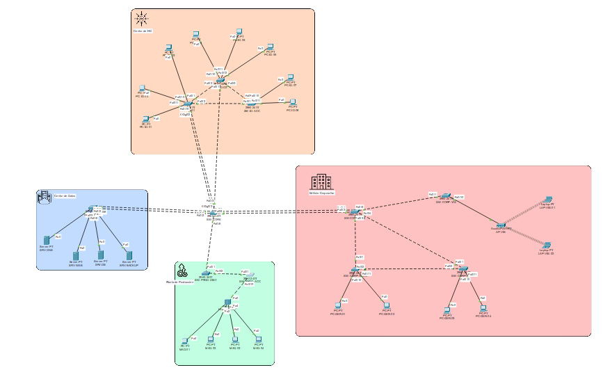

La topología utiliza un switch central en el Centro de Datos. Desde este equipo se distribuyen enlaces hacia las demás áreas. Las áreas críticas cuentan con enlaces redundantes y Rapid-PVST evita que esas redundancias produzcan bucles de Capa 2.


### 2.2 Centro de Datos

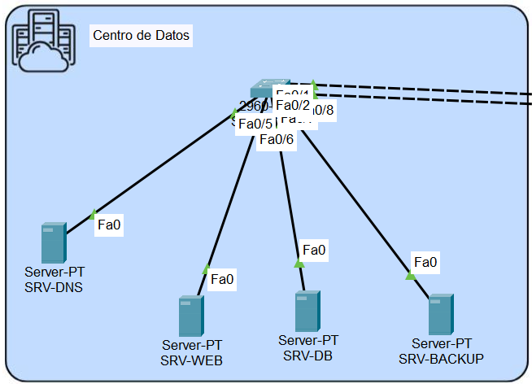

El Centro de Datos contiene `SW-CORE`, `SW-DC-SRV` y cuatro servidores. El enlace entre el Core y el switch de servidores está agregado en `Po1`, evitando que la granja de servidores dependa de un único cable físico.

### 2.3 Centro de Investigación y Desarrollo

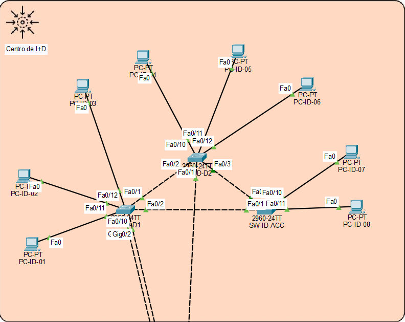

El Centro de I+D utiliza tres switches interconectados en triángulo. Esta estructura proporciona rutas alternativas. Rapid-PVST mantiene una ruta redundante bloqueada y la activa cuando falla la ruta principal.

### 2.4 Edificio Corporativo

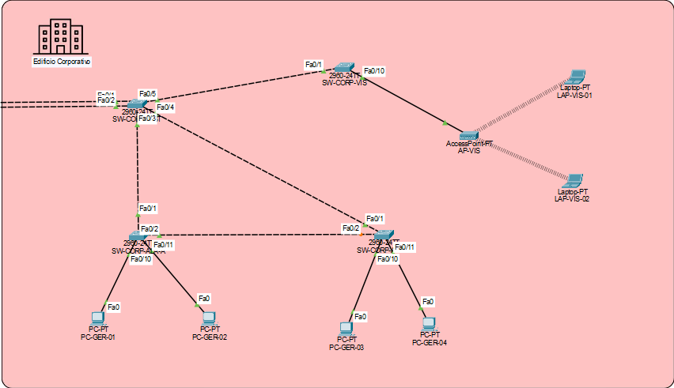

El Edificio Corporativo cuenta con un switch de distribución, dos switches de acceso para las alas A y B, y un switch transparente para visitantes. Las alas mantienen una ruta alternativa entre sí. La red de visitantes se encuentra en la VLAN 55 y utiliza un punto de acceso inalámbrico.

### 2.5 Planta de Producción

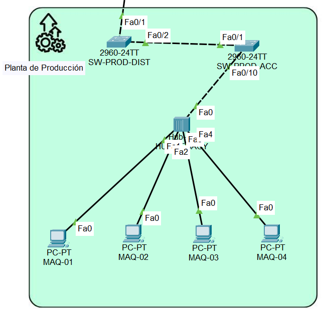

La Planta de Producción contiene un segmento Legacy implementado mediante un hub. Las cuatro máquinas conectadas al hub comparten un único dominio de colisión.

---

## 3. Inventario lógico de dispositivos

| Cantidad | Dispositivo | Función dentro de la topología |
|---:|---|---|
| 1 | Switch Cisco Catalyst 3560-24PS | Core central, servidor VTP y raíz de VLAN 45 y 95 |
| 10 | Switch Cisco Catalyst 2960-24TT | Distribución, acceso, redundancia y conexión de usuarios |
| 4 | Server-PT | DNS, Web, base de datos y respaldo |
| 16 | PC-PT | Ocho equipos de I+D, cuatro de Gerencia y cuatro máquinas Legacy |
| 2 | Laptop-PT | Usuarios inalámbricos de la VLAN de visitantes |
| 1 | AccessPoint-PT | Acceso inalámbrico para visitantes |
| 1 | Hub-PT | Segmento Legacy con dominio de colisión compartido |

---

## 4. VLAN y direccionamiento

### 4.1 Tabla de VLAN

| VLAN ID | Nombre | Área | Red IPv4 | Función |
|---:|---|---|---|---|
| 15 | `GERENCIA` | Edificio Corporativo | `192.168.15.0/24` | Personal administrativo |
| 25 | `INVESTIGACION` | Centro de I+D | `192.168.25.0/24` | Estaciones de investigación |
| 35 | `PRODUCCION` | Planta de Producción | `192.168.35.0/24` | Maquinaria industrial Legacy |
| 45 | `SERVIDORES` | Centro de Datos | `192.168.45.0/24` | Servicios críticos |
| 55 | `VISITANTES` | Edificio Corporativo | `192.168.55.0/24` | Invitados inalámbricos |
| 95 | `NATIVA` | Campus | No asignada a usuarios | VLAN nativa de los trunks |

La VLAN 1 permanece en la base local por ser la VLAN predeterminada de Cisco, pero no se utiliza para tráfico de usuarios ni se permite en los enlaces troncales finales. Las VLAN 1002 a 1005 son VLAN reservadas del sistema y tampoco se consideran VLAN operativas del proyecto.

### 4.2 Direcciones de los dispositivos finales

| Área | Dispositivo | Dirección IP |
|---|---|---|
| Gerencia | PC-GER-01 | `192.168.15.11/24` |
| Gerencia | PC-GER-02 | `192.168.15.12/24` |
| Gerencia | PC-GER-03 | `192.168.15.13/24` |
| Gerencia | PC-GER-04 | `192.168.15.14/24` |
| I+D | PC-ID-01 a PC-ID-08 | `192.168.25.11/24` a `192.168.25.18/24` |
| Producción | MAQ-01 a MAQ-04 | `192.168.35.11/24` a `192.168.35.14/24` |
| Centro de Datos | SRV-DNS | `192.168.45.10/24` |
| Centro de Datos | SRV-WEB | `192.168.45.20/24` |
| Centro de Datos | SRV-DB | `192.168.45.30/24` |
| Centro de Datos | SRV-BACKUP | `192.168.45.40/24` |
| Visitantes | LAP-VIS-01 | `192.168.55.11/24` |
| Visitantes | LAP-VIS-02 | `192.168.55.12/24` |

No se configuró puerta de enlace en los dispositivos porque el alcance del proyecto corresponde a Capa 1 y Capa 2 y no incluye enrutamiento inter-VLAN.

---

## 5. Dominios de broadcast

Cada VLAN operativa constituye un dominio de broadcast independiente. Por lo tanto, la red implementada posee **6 dominios de broadcast operativos**.

| Dominio | VLAN | Nombre | Dispositivos principales | Alcance del broadcast |
|---:|---:|---|---|---|
| 1 | 15 | GERENCIA | PC-GER-01 a PC-GER-04 | Solamente puertos y trunks que transportan VLAN 15 |
| 2 | 25 | INVESTIGACION | PC-ID-01 a PC-ID-08 | Solamente puertos y trunks que transportan VLAN 25 |
| 3 | 35 | PRODUCCION | MAQ-01 a MAQ-04 | Segmento de producción y trunks de VLAN 35 |
| 4 | 45 | SERVIDORES | DNS, Web, DB y Backup | Granja de servidores y `Po1` |
| 5 | 55 | VISITANTES | LAP-VIS-01 y LAP-VIS-02 | AP y enlace de acceso aislado del campus |
| 6 | 95 | NATIVA | Sin hosts finales | Tramas sin etiqueta de los enlaces 802.1Q |

La VLAN 1 no se cuenta como dominio operativo porque todos sus puertos sin uso fueron apagados y no se transporta por los trunks finales.

---

## 6. Dominios de colisión

Un switch crea un dominio de colisión independiente por cada puerto físico activo. Los puertos integrantes de un EtherChannel se contabilizan físicamente, mientras que la interfaz lógica `Port-channel` no agrega un dominio adicional. En el segmento Legacy, el puerto `Fa0/10` de `SW-PROD-ACC`, el hub y las cuatro máquinas pertenecen al mismo dominio compartido.

### 6.1 Dominios generados por cada switch

| Switch | Puertos físicos activos | Cantidad de dominios asociados a sus puertos | Observación |
|---|---|---:|---|
| SW-CORE | Fa0/1-6, Gi0/1-2 | 8 | Incluye seis miembros/enlaces FastEthernet y dos GigabitEthernet de `Po2` |
| SW-DC-SRV | Fa0/1-2, Fa0/5-8 | 6 | Dos enlaces de `Po1` y cuatro servidores |
| SW-ID-D1 | Fa0/1-2, Fa0/10-12, Gi0/1-2 | 7 | Dos enlaces Gigabit de `Po2`, dos trunks y tres PCs |
| SW-ID-D2 | Fa0/1-3, Fa0/10-12 | 6 | Tres trunks y tres PCs |
| SW-ID-ACC | Fa0/1-2, Fa0/10-11 | 4 | Dos trunks y dos PCs |
| SW-CORP-DIST | Fa0/1-5 | 5 | Dos miembros de `Po3`, dos trunks y enlace de visitantes |
| SW-CORP-ALA-A | Fa0/1-2, Fa0/10-11 | 4 | Dos trunks y dos PCs |
| SW-CORP-ALA-B | Fa0/1-2, Fa0/10-11 | 4 | Dos trunks y dos PCs |
| SW-CORP-VIS | Fa0/1, Fa0/10 | 2 | Enlace de acceso a distribución y enlace al AP |
| SW-PROD-DIST | Fa0/1-2 | 2 | Dos trunks |
| SW-PROD-ACC | Fa0/1, Fa0/10 | 2 | Un trunk y un dominio Legacy compartido |
| **Total de extremos de puertos activos** |  | **50** | Conteo administrativo por switch |

Los enlaces entre dos switches aparecen una vez en cada switch. Al deduplicar los 16 enlaces switch a switch, existen **34 segmentos Ethernet físicos únicos**. Adicionalmente, la celda inalámbrica del AP forma un medio compartido de contención basado en CSMA/CA.

### 6.2 Dominio de colisión compartido del segmento Legacy

| Dominio compartido | Elementos | Comportamiento |
|---|---|---|
| Legacy de Producción | `SW-PROD-ACC Fa0/10` + Hub + MAQ-01 + MAQ-02 + MAQ-03 + MAQ-04 | Todos comparten el ancho de banda y solamente un equipo puede transmitir correctamente a la vez |

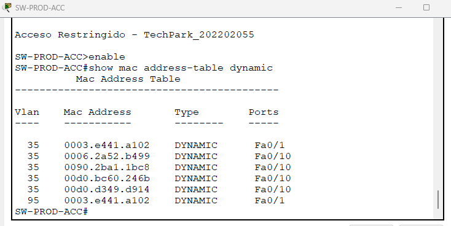

El comando `show mac address-table dynamic` muestra varias direcciones MAC aprendidas por `Fa0/10`, lo que demuestra que detrás de ese único puerto existe el hub con varias máquinas. El hub opera en Capa 1, repite cada señal por todos sus puertos y no separa colisiones. Esto puede producir retransmisiones, reducción del rendimiento y operación half-duplex. El impacto se contiene conectando el hub a un único puerto de acceso en VLAN 35; de esta manera, las colisiones no se extienden a otros puertos o VLAN, aunque no se eliminan dentro del segmento Legacy.

---

## 7. VTP

### 7.1 Distribución de modos VTP

| Dispositivo | Modo VTP | Justificación |
|---|---|---|
| SW-CORE | Server | Punto central y controlado para crear y modificar las VLAN del campus |
| SW-CORP-VIS | Transparent | Aísla la administración de VLAN de visitantes del dominio principal |
| Los otros nueve switches | Client | Reciben automáticamente las VLAN creadas en el servidor |

### 7.2 Evidencia del servidor VTP

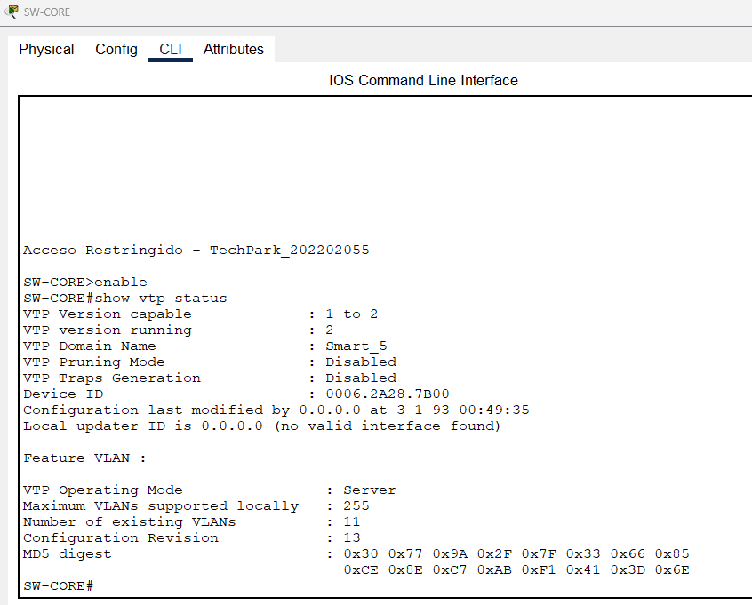

`SW-CORE` fue seleccionado como servidor VTP porque se encuentra en el núcleo de la red, mantiene conexión con todas las áreas y centraliza la administración. La evidencia muestra el dominio `Smart_5`, la versión 2, el modo `Server` y la misma revisión de configuración que fue propagada a los clientes.

La contraseña VTP no se muestra en texto claro mediante `show vtp status`, pero fue configurada como `proyecto12S2026` en todos los integrantes del dominio.

---

## 8. Rapid-PVST y selección de Root Bridge

Rapid-PVST fue seleccionado porque el último dígito del carné es impar. Se definió una raíz primaria y una secundaria para cada VLAN, ubicando la raíz cerca de los dispositivos que generan el tráfico principal.

| VLAN | Root Bridge primario | Prioridad efectiva | Root secundario | Justificación |
|---:|---|---:|---|---|
| 15 | SW-CORP-DIST | 24591 | SW-CORP-ALA-A | La VLAN de Gerencia se concentra en el Edificio Corporativo |
| 25 | SW-ID-D1 | 24601 | SW-ID-D2 | I+D requiere redundancia y `SW-ID-D1` posee el EtherChannel hacia el Core |
| 35 | SW-PROD-DIST | 24611 | SW-PROD-ACC | El switch de distribución es el punto de entrada de Producción |
| 45 | SW-CORE | 24621 | SW-DC-SRV | El Core concentra la comunicación con la granja de servidores |
| 55 | SW-CORP-DIST | 24631 | SW-CORP-VIS | La red de visitantes se origina en el Edificio Corporativo |
| 95 | SW-CORE | 24671 | SW-ID-D1 | La VLAN nativa atraviesa los trunks principales del campus |

En las siguientes evidencias, la frase `This bridge is the root` confirma que el equipo mostrado es la raíz de la VLAN correspondiente.

### 8.1 Root Bridge de VLAN 15

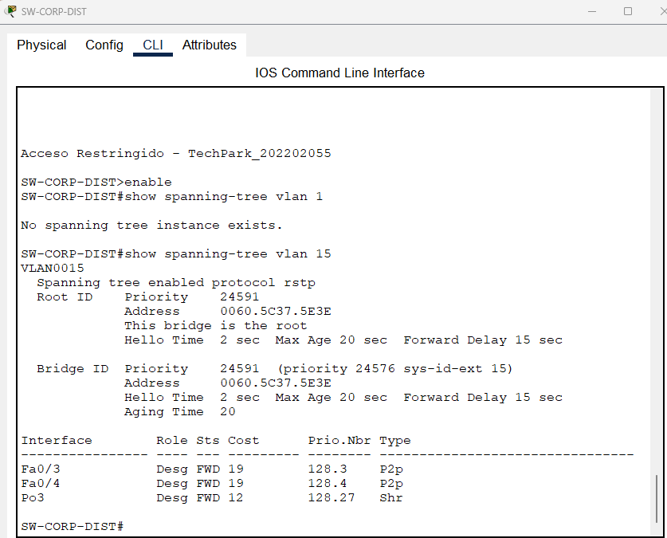

### 8.2 Root Bridge de VLAN 25

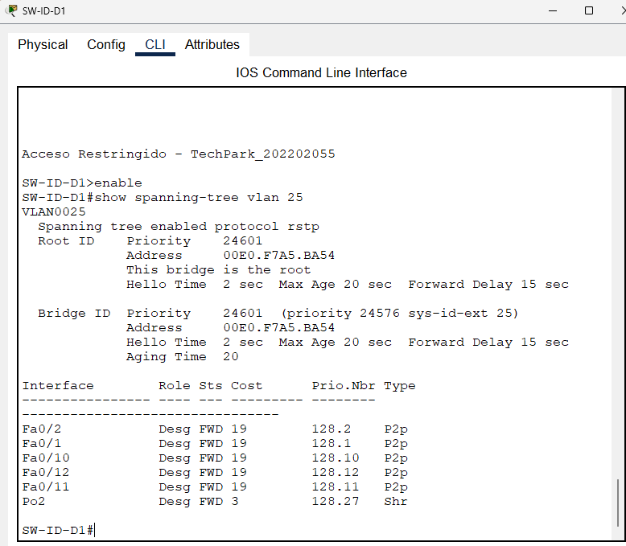

### 8.3 Root Bridge de VLAN 35

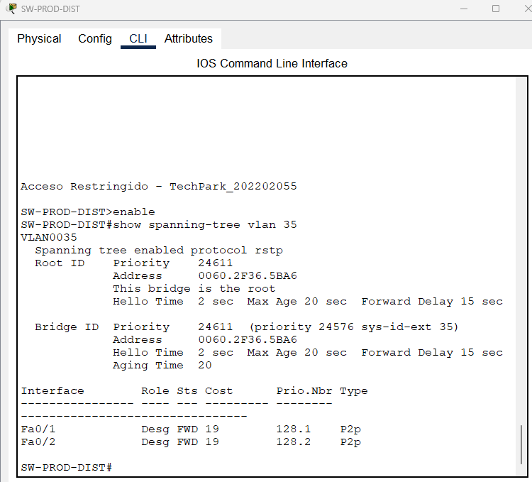

### 8.4 Root Bridge de VLAN 45

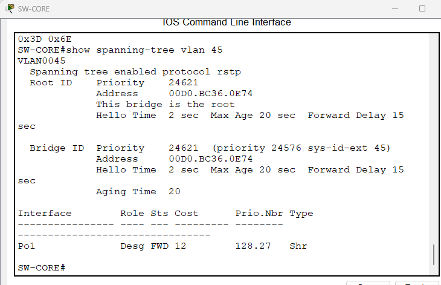

### 8.5 Root Bridge de VLAN 55


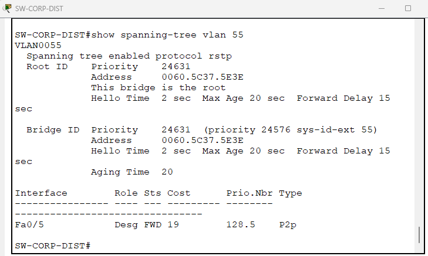


### 8.6 Root Bridge de VLAN 95

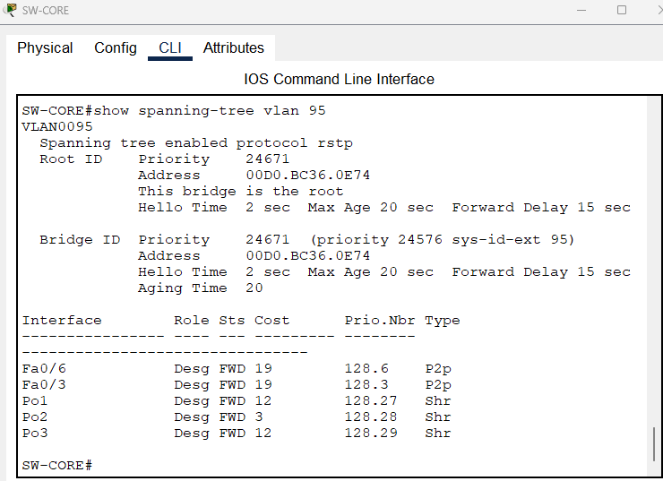

### 8.7 Resumen de Spanning Tree

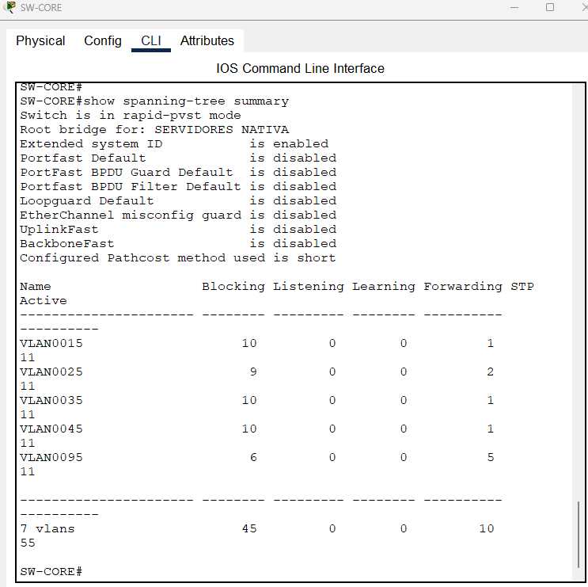

La evidencia confirma que el modo activo es `rapid-pvst` y que `SW-CORE` funciona como raíz de `SERVIDORES` y `NATIVA`. En VLAN 15, `Po3` es el puerto raíz en el Core; en VLAN 25, `Po2` es raíz y `Fa0/3` permanece como ruta designada alternativa.

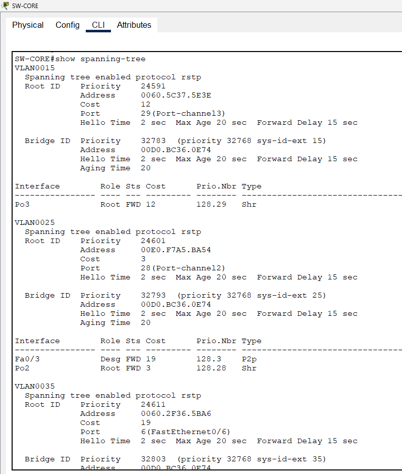

---

## 9. EtherChannel

| Port-channel | Extremos | Interfaces físicas | Protocolo | VLAN permitidas | Justificación |
|---|---|---|---|---|---|
| Po1 | SW-CORE - SW-DC-SRV | Fa0/1 y Fa0/2 en ambos switches | PAgP | 45,95 | Evita que los servidores dependan de una sola conexión y agrega capacidad |
| Po2 | SW-CORE - SW-ID-D1 | Gi0/1 y Gi0/2 en ambos switches | PAgP | 25,95 | Proporciona el enlace de mayor capacidad hacia I+D |
| Po3 | SW-CORE - SW-CORP-DIST | Core Fa0/4-5 y Dist Fa0/1-2 | PAgP | 15,95 | Aumenta la capacidad y disponibilidad del Edificio Corporativo |

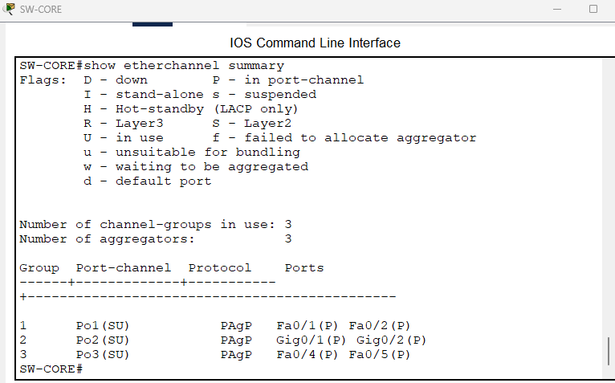

El indicador `(SU)` significa que cada Port-channel es de Capa 2 y se encuentra en uso. El indicador `(P)` en cada interfaz confirma que el puerto físico está correctamente incorporado al canal. Los tres grupos utilizan PAgP, tal como corresponde a un carné impar.

---

## 10. Asignación de puertos por switch

| Switch | Puerto o rango | Modo | VLAN | Destino o función |
|---|---|---|---|---|
| SW-CORE | Fa0/1-2 | Trunk / Po1 | 45,95 | SW-DC-SRV |
| SW-CORE | Gi0/1-2 | Trunk / Po2 | 25,95 | SW-ID-D1 |
| SW-CORE | Fa0/3 | Trunk | 25,95 | SW-ID-D2, ruta redundante |
| SW-CORE | Fa0/4-5 | Trunk / Po3 | 15,95 | SW-CORP-DIST |
| SW-CORE | Fa0/6 | Trunk | 35,95 | SW-PROD-DIST |
| SW-CORE | Fa0/7-24 | Apagado | 1 | No utilizado |
| SW-DC-SRV | Fa0/1-2 | Trunk / Po1 | 45,95 | SW-CORE |
| SW-DC-SRV | Fa0/5 | Access | 45 | SRV-DNS |
| SW-DC-SRV | Fa0/6 | Access | 45 | SRV-WEB |
| SW-DC-SRV | Fa0/7 | Access | 45 | SRV-DB |
| SW-DC-SRV | Fa0/8 | Access | 45 | SRV-BACKUP |
| SW-DC-SRV | Fa0/3-4, Fa0/9-24, Gi0/1-2 | Apagado | 1 | No utilizado |
| SW-ID-D1 | Gi0/1-2 | Trunk / Po2 | 25,95 | SW-CORE |
| SW-ID-D1 | Fa0/1 | Trunk | 25,95 | SW-ID-D2 |
| SW-ID-D1 | Fa0/2 | Trunk | 25,95 | SW-ID-ACC |
| SW-ID-D1 | Fa0/10-12 | Access | 25 | PC-ID-01 a PC-ID-03 |
| SW-ID-D1 | Fa0/3-9, Fa0/13-24 | Apagado | 1 | No utilizado |
| SW-ID-D2 | Fa0/1 | Trunk | 25,95 | SW-CORE |
| SW-ID-D2 | Fa0/2 | Trunk | 25,95 | SW-ID-D1 |
| SW-ID-D2 | Fa0/3 | Trunk | 25,95 | SW-ID-ACC |
| SW-ID-D2 | Fa0/10-12 | Access | 25 | PC-ID-04 a PC-ID-06 |
| SW-ID-D2 | Fa0/4-9, Fa0/13-24, Gi0/1-2 | Apagado | 1 | No utilizado |
| SW-ID-ACC | Fa0/1 | Trunk | 25,95 | SW-ID-D1 |
| SW-ID-ACC | Fa0/2 | Trunk | 25,95 | SW-ID-D2 |
| SW-ID-ACC | Fa0/10-11 | Access | 25 | PC-ID-07 y PC-ID-08 |
| SW-ID-ACC | Fa0/3-9, Fa0/12-24, Gi0/1-2 | Apagado | 1 | No utilizado |
| SW-CORP-DIST | Fa0/1-2 | Trunk / Po3 | 15,95 | SW-CORE |
| SW-CORP-DIST | Fa0/3 | Trunk | 15,95 | SW-CORP-ALA-A |
| SW-CORP-DIST | Fa0/4 | Trunk | 15,95 | SW-CORP-ALA-B |
| SW-CORP-DIST | Fa0/5 | Access | 55 | SW-CORP-VIS |
| SW-CORP-DIST | Fa0/6-24, Gi0/1-2 | Apagado | 1 | No utilizado |
| SW-CORP-ALA-A | Fa0/1 | Trunk | 15,95 | SW-CORP-DIST |
| SW-CORP-ALA-A | Fa0/2 | Trunk | 15,95 | SW-CORP-ALA-B |
| SW-CORP-ALA-A | Fa0/10-11 | Access | 15 | PC-GER-01 y PC-GER-02 |
| SW-CORP-ALA-A | Fa0/3-9, Fa0/12-24, Gi0/1-2 | Apagado | 1 | No utilizado |
| SW-CORP-ALA-B | Fa0/1 | Trunk | 15,95 | SW-CORP-DIST |
| SW-CORP-ALA-B | Fa0/2 | Trunk | 15,95 | SW-CORP-ALA-A |
| SW-CORP-ALA-B | Fa0/10-11 | Access | 15 | PC-GER-03 y PC-GER-04 |
| SW-CORP-ALA-B | Fa0/3-9, Fa0/12-24, Gi0/1-2 | Apagado | 1 | No utilizado |
| SW-CORP-VIS | Fa0/1 | Access | 55 | SW-CORP-DIST |
| SW-CORP-VIS | Fa0/10 | Access | 55 | AP-VIS |
| SW-CORP-VIS | Fa0/2-9, Fa0/11-24, Gi0/1-2 | Apagado | 1 | No utilizado |
| SW-PROD-DIST | Fa0/1 | Trunk | 35,95 | SW-CORE |
| SW-PROD-DIST | Fa0/2 | Trunk | 35,95 | SW-PROD-ACC |
| SW-PROD-DIST | Fa0/3-24, Gi0/1-2 | Apagado | 1 | No utilizado |
| SW-PROD-ACC | Fa0/1 | Trunk | 35,95 | SW-PROD-DIST |
| SW-PROD-ACC | Fa0/10 | Access | 35 | Hub Legacy |
| SW-PROD-ACC | Fa0/2-9, Fa0/11-24, Gi0/1-2 | Apagado | 1 | No utilizado |

---

## 11. Medios de transmisión

### 11.1 Medios utilizados

| Tipo de segmento | Medio utilizado | Justificación |
|---|---|---|
| Switch a switch | UTP Cat 6, Copper Cross-Over | Enlaces Ethernet de distancia asumida menor a 100 m. Cat 6 permite Fast Ethernet y Gigabit Ethernet; el cable cruzado representa la conexión entre dispositivos del mismo tipo en Packet Tracer |
| Miembros de EtherChannel | Dos cables UTP Cat 6 por canal | Cada cable constituye un enlace físico independiente; PAgP los agrupa lógicamente y mantiene servicio si falla un integrante |
| Switch a servidor, PC, AP o hub | UTP Cat 6, Copper Straight-Through | Conecta dispositivos de tipos diferentes y ofrece una instalación económica dentro de cada área |
| Hub a máquinas Legacy | UTP Cat 6, Copper Straight-Through | Mantiene compatibilidad con el segmento heredado; todos los equipos conservan un dominio de colisión compartido |
| AP a laptops | Radiofrecuencia Wi-Fi 2.4 GHz | Proporciona movilidad a visitantes mediante el SSID `TECHPARK_VISITANTES` y WPA2-PSK |
| Fibra óptica | No implementada en la simulación | Los modelos y puertos empleados en Packet Tracer se conectaron por cobre y se asumieron recorridos menores a 100 m |

En una implementación física donde una ruta interedificios supere 100 m, exista interferencia electromagnética importante o se necesite mayor escalabilidad, se recomienda sustituir el enlace correspondiente por fibra multimodo OM3 u OS2 y equipos con módulos SFP compatibles.

### 11.2 Etiquetas que deben aparecer en Packet Tracer

| Segmento | Etiqueta recomendada |
|---|---|
| SW-CORE - SW-DC-SRV | `2x UTP Cat6 Crossover - PAgP Po1 - Trunk VLAN 45,95` |
| SW-CORE - SW-ID-D1 | `2x UTP Cat6 Crossover - PAgP Po2 - Trunk VLAN 25,95` |
| SW-CORE - SW-CORP-DIST | `2x UTP Cat6 Crossover - PAgP Po3 - Trunk VLAN 15,95` |
| SW-CORE - SW-ID-D2 | `UTP Cat6 Crossover - Trunk VLAN 25,95 - Respaldo` |
| SW-CORE - SW-PROD-DIST | `UTP Cat6 Crossover - Trunk VLAN 35,95` |
| Triángulo de I+D | `UTP Cat6 Crossover - Trunk VLAN 25,95` |
| Enlaces entre switches corporativos | `UTP Cat6 Crossover - Trunk VLAN 15,95` |
| SW-CORP-DIST - SW-CORP-VIS | `UTP Cat6 Crossover - Access VLAN 55` |
| SW-PROD-DIST - SW-PROD-ACC | `UTP Cat6 Crossover - Trunk VLAN 35,95` |
| Switches a equipos finales | `UTP Cat6 Straight-Through - Puerto Access` |
| SW-PROD-ACC - Hub - máquinas | `UTP Cat6 Straight-Through - Segmento Legacy compartido` |
| AP-VIS - laptops | `Wi-Fi 2.4 GHz - SSID TECHPARK_VISITANTES - WPA2-PSK` |

---

## 12. Comandos utilizados

### 12.1 Configuración común aplicada en los switches

El nombre de host se cambió según cada dispositivo. El siguiente bloque resume la configuración común:

```ios
enable
configure terminal
hostname <NOMBRE_DEL_SWITCH>
spanning-tree mode rapid-pvst
banner motd #Acceso Restringido - TechPark_202202055#
end
write memory
```

En todos los puertos de acceso conectados a dispositivos finales se aplicó:

```ios
switchport mode access
switchport access vlan <ID>
spanning-tree portfast
spanning-tree bpduguard enable
no shutdown
```

No se aplicó PortFast ni BPDU Guard al enlace de acceso entre `SW-CORP-DIST` y `SW-CORP-VIS`, porque conecta dos switches.

### 12.2 SW-CORE

```ios
enable
configure terminal
hostname SW-CORE
vtp domain Smart_5
vtp password proyecto12S2026
vtp version 2
vtp mode server

vlan 15
 name GERENCIA
vlan 25
 name INVESTIGACION
vlan 35
 name PRODUCCION
vlan 45
 name SERVIDORES
vlan 55
 name VISITANTES
vlan 95
 name NATIVA

spanning-tree mode rapid-pvst
spanning-tree vlan 45 root primary
spanning-tree vlan 95 root primary

interface range fa0/1-2
 description PAGP_HACIA_SW_DC_SRV
 switchport mode trunk
 switchport trunk native vlan 95
 switchport trunk allowed vlan 45,95
 channel-group 1 mode desirable
 no shutdown
exit
interface port-channel 1
 switchport mode trunk
 switchport trunk native vlan 95
 switchport trunk allowed vlan 45,95
exit

interface range gi0/1-2
 description PAGP_HACIA_SW_ID_D1
 switchport mode trunk
 switchport trunk native vlan 95
 switchport trunk allowed vlan 25,95
 channel-group 2 mode desirable
 no shutdown
exit
interface port-channel 2
 switchport mode trunk
 switchport trunk native vlan 95
 switchport trunk allowed vlan 25,95
exit

interface range fa0/4-5
 description PAGP_HACIA_SW_CORP_DIST
 switchport mode trunk
 switchport trunk native vlan 95
 switchport trunk allowed vlan 15,95
 channel-group 3 mode desirable
 no shutdown
exit
interface port-channel 3
 switchport mode trunk
 switchport trunk native vlan 95
 switchport trunk allowed vlan 15,95
exit

interface fa0/3
 description TRUNK_HACIA_SW_ID_D2
 switchport mode trunk
 switchport trunk native vlan 95
 switchport trunk allowed vlan 25,95
 no shutdown
exit

interface fa0/6
 description TRUNK_HACIA_SW_PROD_DIST
 switchport mode trunk
 switchport trunk native vlan 95
 switchport trunk allowed vlan 35,95
 no shutdown
exit

interface range fa0/7-24
 description PUERTO_NO_UTILIZADO
 switchport mode access
 shutdown
exit
banner motd #Acceso Restringido - TechPark_202202055#
end
write memory
```

### 12.3 SW-DC-SRV

```ios
enable
configure terminal
hostname SW-DC-SRV
vtp domain Smart_5
vtp password proyecto12S2026
vtp version 2
vtp mode client
spanning-tree mode rapid-pvst
spanning-tree vlan 45 root secondary

interface range fa0/1-2
 description PAGP_HACIA_SW_CORE
 switchport mode trunk
 switchport trunk native vlan 95
 switchport trunk allowed vlan 45,95
 channel-group 1 mode auto
 no shutdown
exit
interface port-channel 1
 switchport mode trunk
 switchport trunk native vlan 95
 switchport trunk allowed vlan 45,95
exit

interface range fa0/5-8
 switchport mode access
 switchport access vlan 45
 spanning-tree portfast
 spanning-tree bpduguard enable
 no shutdown
exit

interface range fa0/3-4
 description PUERTO_NO_UTILIZADO
 switchport mode access
 shutdown
exit
interface range fa0/9-24
 description PUERTO_NO_UTILIZADO
 switchport mode access
 shutdown
exit
interface range gi0/1-2
 description PUERTO_NO_UTILIZADO
 switchport mode access
 shutdown
exit
banner motd #Acceso Restringido - TechPark_202202055#
end
write memory
```

### 12.4 SW-ID-D1

```ios
enable
configure terminal
hostname SW-ID-D1
vtp domain Smart_5
vtp password proyecto12S2026
vtp version 2
vtp mode client
spanning-tree mode rapid-pvst
spanning-tree vlan 25 root primary
spanning-tree vlan 95 root secondary

interface range gi0/1-2
 description PAGP_HACIA_SW_CORE
 switchport mode trunk
 switchport trunk native vlan 95
 switchport trunk allowed vlan 25,95
 channel-group 2 mode auto
 no shutdown
exit
interface port-channel 2
 switchport mode trunk
 switchport trunk native vlan 95
 switchport trunk allowed vlan 25,95
exit

interface range fa0/1-2
 switchport mode trunk
 switchport trunk native vlan 95
 switchport trunk allowed vlan 25,95
 no shutdown
exit

interface range fa0/10-12
 switchport mode access
 switchport access vlan 25
 spanning-tree portfast
 spanning-tree bpduguard enable
 no shutdown
exit

interface range fa0/3-9
 description PUERTO_NO_UTILIZADO
 switchport mode access
 shutdown
exit
interface range fa0/13-24
 description PUERTO_NO_UTILIZADO
 switchport mode access
 shutdown
exit
banner motd #Acceso Restringido - TechPark_202202055#
end
write memory
```

### 12.5 SW-ID-D2

```ios
enable
configure terminal
hostname SW-ID-D2
vtp domain Smart_5
vtp password proyecto12S2026
vtp version 2
vtp mode client
spanning-tree mode rapid-pvst
spanning-tree vlan 25 root secondary

interface range fa0/1-3
 switchport mode trunk
 switchport trunk native vlan 95
 switchport trunk allowed vlan 25,95
 no shutdown
exit
interface range fa0/10-12
 switchport mode access
 switchport access vlan 25
 spanning-tree portfast
 spanning-tree bpduguard enable
 no shutdown
exit
interface range fa0/4-9
 description PUERTO_NO_UTILIZADO
 switchport mode access
 shutdown
exit
interface range fa0/13-24
 description PUERTO_NO_UTILIZADO
 switchport mode access
 shutdown
exit
interface range gi0/1-2
 description PUERTO_NO_UTILIZADO
 switchport mode access
 shutdown
exit
banner motd #Acceso Restringido - TechPark_202202055#
end
write memory
```

### 12.6 SW-ID-ACC

```ios
enable
configure terminal
hostname SW-ID-ACC
vtp domain Smart_5
vtp password proyecto12S2026
vtp version 2
vtp mode client
spanning-tree mode rapid-pvst

interface range fa0/1-2
 switchport mode trunk
 switchport trunk native vlan 95
 switchport trunk allowed vlan 25,95
 no shutdown
exit
interface range fa0/10-11
 switchport mode access
 switchport access vlan 25
 spanning-tree portfast
 spanning-tree bpduguard enable
 no shutdown
exit
interface range fa0/3-9
 description PUERTO_NO_UTILIZADO
 switchport mode access
 shutdown
exit
interface range fa0/12-24
 description PUERTO_NO_UTILIZADO
 switchport mode access
 shutdown
exit
interface range gi0/1-2
 description PUERTO_NO_UTILIZADO
 switchport mode access
 shutdown
exit
banner motd #Acceso Restringido - TechPark_202202055#
end
write memory
```

### 12.7 SW-CORP-DIST

```ios
enable
configure terminal
hostname SW-CORP-DIST
vtp domain Smart_5
vtp password proyecto12S2026
vtp version 2
vtp mode client
spanning-tree mode rapid-pvst
spanning-tree vlan 15 root primary
spanning-tree vlan 55 root primary

interface range fa0/1-2
 description PAGP_HACIA_SW_CORE
 switchport mode trunk
 switchport trunk native vlan 95
 switchport trunk allowed vlan 15,95
 channel-group 3 mode auto
 no shutdown
exit
interface port-channel 3
 switchport mode trunk
 switchport trunk native vlan 95
 switchport trunk allowed vlan 15,95
exit

interface range fa0/3-4
 switchport mode trunk
 switchport trunk native vlan 95
 switchport trunk allowed vlan 15,95
 no shutdown
exit
interface fa0/5
 description ACCESO_HACIA_SW_CORP_VIS
 switchport mode access
 switchport access vlan 55
 no shutdown
exit
interface range fa0/6-24
 description PUERTO_NO_UTILIZADO
 switchport mode access
 shutdown
exit
interface range gi0/1-2
 description PUERTO_NO_UTILIZADO
 switchport mode access
 shutdown
exit
banner motd #Acceso Restringido - TechPark_202202055#
end
write memory
```

### 12.8 SW-CORP-ALA-A

```ios
enable
configure terminal
hostname SW-CORP-ALA-A
vtp domain Smart_5
vtp password proyecto12S2026
vtp version 2
vtp mode client
spanning-tree mode rapid-pvst
spanning-tree vlan 15 root secondary

interface range fa0/1-2
 switchport mode trunk
 switchport trunk native vlan 95
 switchport trunk allowed vlan 15,95
 no shutdown
exit
interface range fa0/10-11
 switchport mode access
 switchport access vlan 15
 spanning-tree portfast
 spanning-tree bpduguard enable
 no shutdown
exit
interface range fa0/3-9
 description PUERTO_NO_UTILIZADO
 switchport mode access
 shutdown
exit
interface range fa0/12-24
 description PUERTO_NO_UTILIZADO
 switchport mode access
 shutdown
exit
interface range gi0/1-2
 description PUERTO_NO_UTILIZADO
 switchport mode access
 shutdown
exit
banner motd #Acceso Restringido - TechPark_202202055#
end
write memory
```

### 12.9 SW-CORP-ALA-B

```ios
enable
configure terminal
hostname SW-CORP-ALA-B
vtp domain Smart_5
vtp password proyecto12S2026
vtp version 2
vtp mode client
spanning-tree mode rapid-pvst

interface range fa0/1-2
 switchport mode trunk
 switchport trunk native vlan 95
 switchport trunk allowed vlan 15,95
 no shutdown
exit
interface range fa0/10-11
 switchport mode access
 switchport access vlan 15
 spanning-tree portfast
 spanning-tree bpduguard enable
 no shutdown
exit
interface range fa0/3-9
 description PUERTO_NO_UTILIZADO
 switchport mode access
 shutdown
exit
interface range fa0/12-24
 description PUERTO_NO_UTILIZADO
 switchport mode access
 shutdown
exit
interface range gi0/1-2
 description PUERTO_NO_UTILIZADO
 switchport mode access
 shutdown
exit
banner motd #Acceso Restringido - TechPark_202202055#
end
write memory
```

### 12.10 SW-CORP-VIS

```ios
enable
configure terminal
hostname SW-CORP-VIS
vtp domain Smart_5
vtp password proyecto12S2026
vtp version 2
vtp mode transparent
vlan 55
 name VISITANTES
spanning-tree mode rapid-pvst
spanning-tree vlan 55 root secondary

interface fa0/1
 description ACCESO_HACIA_SW_CORP_DIST
 switchport mode access
 switchport access vlan 55
 no shutdown
exit
interface fa0/10
 description ACCESO_HACIA_AP_VIS
 switchport mode access
 switchport access vlan 55
 spanning-tree portfast
 spanning-tree bpduguard enable
 no shutdown
exit
interface range fa0/2-9
 description PUERTO_NO_UTILIZADO
 switchport mode access
 shutdown
exit
interface range fa0/11-24
 description PUERTO_NO_UTILIZADO
 switchport mode access
 shutdown
exit
interface range gi0/1-2
 description PUERTO_NO_UTILIZADO
 switchport mode access
 shutdown
exit
banner motd #Acceso Restringido - TechPark_202202055#
end
write memory
```

### 12.11 SW-PROD-DIST

```ios
enable
configure terminal
hostname SW-PROD-DIST
vtp domain Smart_5
vtp password proyecto12S2026
vtp version 2
vtp mode client
spanning-tree mode rapid-pvst
spanning-tree vlan 35 root primary

interface range fa0/1-2
 switchport mode trunk
 switchport trunk native vlan 95
 switchport trunk allowed vlan 35,95
 no shutdown
exit
interface range fa0/3-24
 description PUERTO_NO_UTILIZADO
 switchport mode access
 shutdown
exit
interface range gi0/1-2
 description PUERTO_NO_UTILIZADO
 switchport mode access
 shutdown
exit
banner motd #Acceso Restringido - TechPark_202202055#
end
write memory
```

### 12.12 SW-PROD-ACC

```ios
enable
configure terminal
hostname SW-PROD-ACC
vtp domain Smart_5
vtp password proyecto12S2026
vtp version 2
vtp mode client
spanning-tree mode rapid-pvst
spanning-tree vlan 35 root secondary

interface fa0/1
 switchport mode trunk
 switchport trunk native vlan 95
 switchport trunk allowed vlan 35,95
 no shutdown
exit
interface fa0/10
 description SEGMENTO_LEGACY_HUB
 switchport mode access
 switchport access vlan 35
 spanning-tree portfast
 spanning-tree bpduguard enable
 no shutdown
exit
interface range fa0/2-9
 description PUERTO_NO_UTILIZADO
 switchport mode access
 shutdown
exit
interface range fa0/11-24
 description PUERTO_NO_UTILIZADO
 switchport mode access
 shutdown
exit
interface range gi0/1-2
 description PUERTO_NO_UTILIZADO
 switchport mode access
 shutdown
exit
banner motd #Acceso Restringido - TechPark_202202055#
end
write memory
```

### 12.13 AP-VIS y laptops de visitantes

| Parámetro | Configuración |
|---|---|
| SSID | `TECHPARK_VISITANTES` |
| Seguridad | WPA2-PSK |
| Clave precompartida | `VisitaTech_55` |
| Canal | 1 |
| LAP-VIS-01 | `192.168.55.11/24` |
| LAP-VIS-02 | `192.168.55.12/24` |

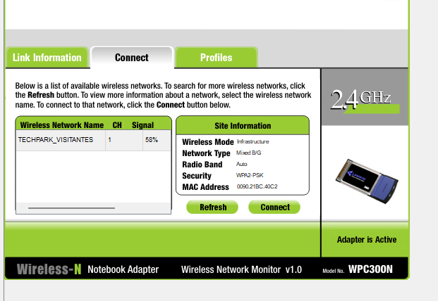

---

## 13. Seguridad básica

### 13.1 Banner MOTD

El banner fue configurado en los switches con el texto obligatorio:

```text
Acceso Restringido - TechPark_202202055
```

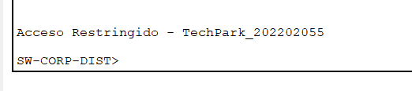

### 13.2 Puertos no utilizados

Los puertos no utilizados fueron configurados como puertos de acceso, identificados con la descripción `PUERTO_NO_UTILIZADO` y apagados administrativamente mediante `shutdown`.

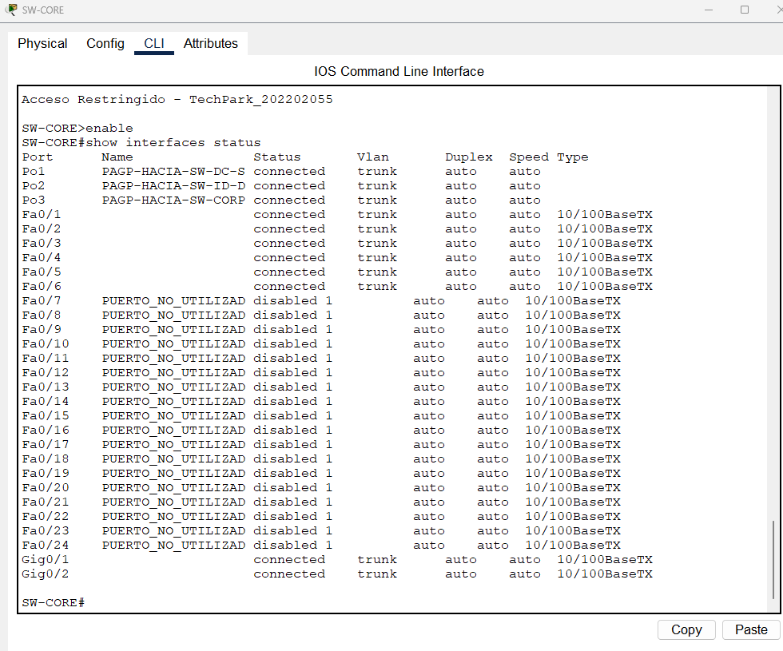

El estado `disabled` confirma el apagado administrativo. El estado `err-disabled` no aparece, por lo que no existen puertos bloqueados por una condición de error.

---

## 14. Evidencias de pruebas

### 14.1 Trunks

Comando ejecutado en `SW-CORE`:

```ios
show interfaces trunk
```

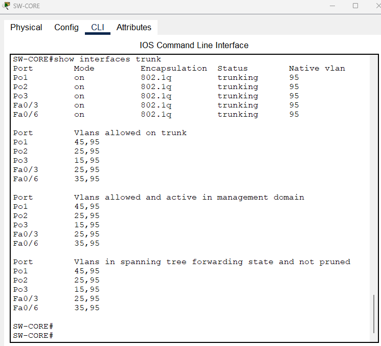

La salida confirma que `Po1`, `Po2`, `Po3`, `Fa0/3` y `Fa0/6` se encuentran en estado `trunking`, usan encapsulación 802.1Q y tienen configurada la VLAN nativa 95.

### 14.2 EtherChannel

Comando ejecutado en `SW-CORE`:

```ios
show etherchannel summary
```


Los tres Port-channel aparecen como `(SU)` y todos sus integrantes como `(P)`.

### 14.3 Spanning Tree

Comandos ejecutados en `SW-CORE`:

```ios
show spanning-tree summary
show spanning-tree vlan 15
show spanning-tree vlan 25
```


Para cumplir literalmente con la evidencia solicitada, todavía debe agregarse la salida de:

```ios
show spanning-tree
```

### 14.4 Conectividad dentro de las VLAN

| Prueba | Origen | Destino | Resultado esperado | Resultado obtenido |
|---|---|---|---|---|
| VLAN 15 | PC-GER-01 | `192.168.15.14` | Respuesta | 4/4, 0 % pérdida |
| VLAN 25 | PC-ID-01 | `192.168.25.18` | Respuesta | 4/4, 0 % pérdida |
| VLAN 35 | MAQ-01 | `192.168.35.14` | Respuesta | 4/4, 0 % pérdida |
| VLAN 45 | SRV-DNS | `192.168.45.20`, `.30`, `.40` | Respuesta | 4/4, 0 % pérdida |
| VLAN 55 | LAP-VIS-01 | `192.168.55.12` | Respuesta | 4/4, 0 % pérdida |

#### VLAN 15 - Gerencia

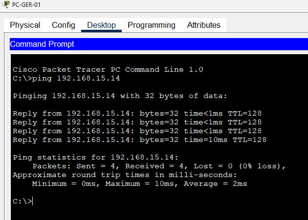

#### VLAN 25 - Investigación

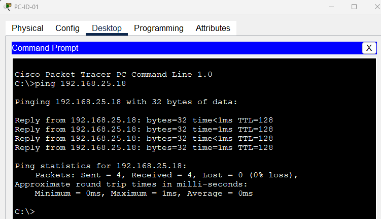

#### VLAN 35 - Producción

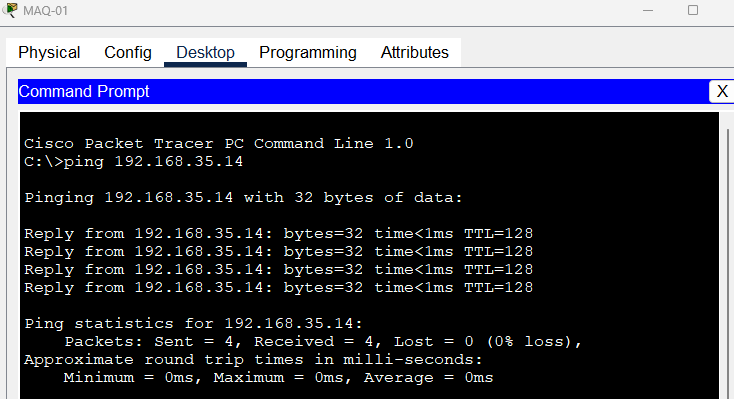

#### VLAN 45 - Servidores

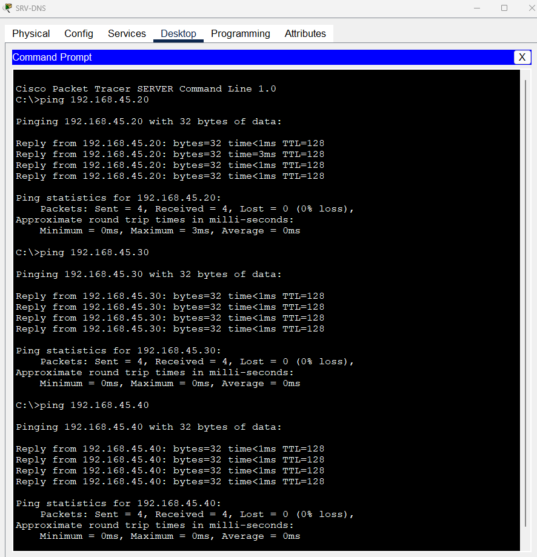

#### VLAN 55 - Visitantes

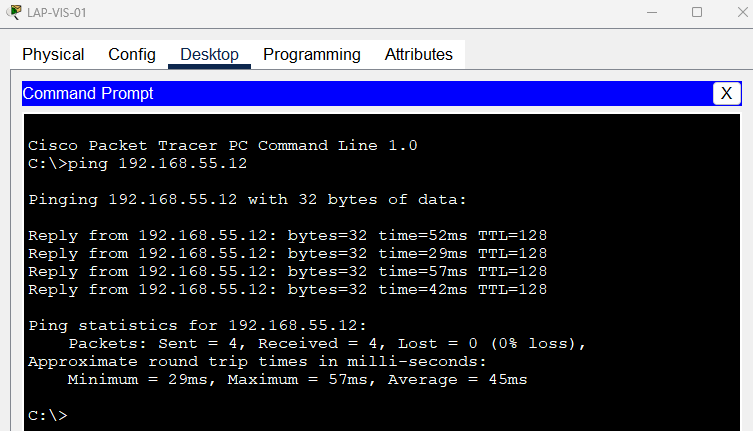

### 14.5 Aislamiento entre VLAN

También se realizaron pings desde una VLAN hacia direcciones pertenecientes a otras VLAN. Las solicitudes expiraron, lo cual es el comportamiento correcto porque no existe un dispositivo de Capa 3 que realice enrutamiento inter-VLAN. Esto demuestra que Gerencia, Investigación, Producción, Servidores y Visitantes se encuentran aislados entre sí.

### 14.6 Pruebas controladas de tolerancia a fallos

| Prueba | Acción | Resultado |
|---|---|---|
| EtherChannel Po1 | Se apagó temporalmente un integrante | `Po1(SU)` permaneció activo con el segundo enlace `(P)` |
| EtherChannel Po2 | Se apagó temporalmente un integrante | `Po2(SU)` permaneció activo con el segundo enlace `(P)` |
| EtherChannel Po3 | Se apagó temporalmente un integrante | `Po3(SU)` permaneció activo con el segundo enlace `(P)` |
| Triángulo de I+D | Se desactivó una ruta | Rapid-PVST habilitó la ruta alternativa y se mantuvo la conectividad |
| Edificio Corporativo | Se desactivó una ruta entre distribución y un ala | Las dos alas continuaron comunicándose por el enlace alternativo |
| Restauración | Se habilitaron todos los enlaces de producción | Los Port-channel regresaron con todos sus integrantes `(P)` |

---

## 15. Presupuesto estimado revisado

Cotización académica consultada el **18 de septiembre de 2026**. El presupuesto ahora incluye todos los equipos finales simulados: infraestructura de red, cuatro servidores, dieciséis computadoras de escritorio y dos computadoras portátiles. Los modelos Catalyst 2960 y 3560 están fuera de su ciclo comercial normal; por ello se presupuestan reacondicionados y se convierten a quetzales con el tipo de cambio de referencia de **Q7.62944 por USD**, publicado por el Banco de Guatemala el 17 de septiembre de 2026.

### 15.1 Criterios de estimación

- Los **16 PC-PT** corresponden a ocho equipos de I+D, cuatro de Gerencia y cuatro equipos que representan las máquinas Legacy.
- Para los PC-PT se seleccionó como equivalencia una computadora HP All-in-One de 27 pulgadas, Ryzen 7, 16 GB de RAM y SSD de 512 GB. El precio incluye pantalla y el modelo de referencia incluye teclado y mouse, por lo que estos componentes no se duplican en el presupuesto.
- Las **2 Laptop-PT** de Visitantes se representan con laptops Acer Aspire 3, Core i5, 16 GB de RAM y SSD de 512 GB.
- Los **4 Server-PT** se representan con servidores físicos Dell PowerEdge T150, Xeon E-2336, 16 GB de RAM y disco de 2 TB. El precio corresponde al hardware y no incluye licencias de sistema operativo de servidor ni CAL.
- Las cuatro máquinas de Producción se cotizan como computadoras de propósito general porque Packet Tracer las implementa mediante PC-PT. El precio de maquinaria industrial, PLC o controladores especializados requeriría una cotización independiente.

### 15.2 Detalle de equipos y materiales

| Categoría | Elemento de referencia | Cantidad | Precio unitario estimado | Subtotal |
|---|---|---:|---:|---:|
| Red | Cisco Catalyst 3560-24PS reacondicionado | 1 | Q1,125.00 | Q1,125.00 |
| Red | Cisco Catalyst 2960-24TT reacondicionado | 10 | Q825.00 | Q8,250.00 |
| Servidores | Dell PowerEdge T150, Xeon E-2336, 16 GB RAM, 2 TB | 4 | Q16,339.77 | Q65,359.08 |
| Computadoras | HP All-in-One 27-cr0275la, Ryzen 7, 16 GB RAM, SSD 512 GB | 16 | Q8,964.99 | Q143,439.84 |
| Computadoras | Acer Aspire 3, Core i5-1235U, 16 GB RAM, SSD 512 GB | 2 | Q4,995.00 | Q9,990.00 |
| Red | Punto de acceso inalámbrico equivalente | 1 | Q547.00 | Q547.00 |
| Red | Hub Ethernet Legacy reacondicionado | 1 | Q200.00 | Q200.00 |
| Cableado | Bobina UTP Cat 6 de 305 m | 3 | Q540.00 | Q1,620.00 |
| Cableado | Conectores RJ45 Cat 6 y consumibles | 1 lote | Q200.00 | Q200.00 |
| Fibra no utilizada | Módulo SFP 1G multimodo | 0 | Q353.20 | Q0.00 |
| Fibra no utilizada | Fibra óptica OM3 | 0 m | Q32.00/m | Q0.00 |

### 15.3 Resumen económico

| Bloque presupuestario | Subtotal |
|---|---:|
| Infraestructura de red y cableado | Q11,942.00 |
| Cuatro servidores físicos | Q65,359.08 |
| Dieciséis computadoras All-in-One | Q143,439.84 |
| Dos computadoras portátiles | Q9,990.00 |
| **Subtotal directo** | **Q230,730.92** |
| Contingencia por variación de precios, flete e insumos menores (10 %) | Q23,073.09 |
| **Total estimado del proyecto** | **Q253,804.01** |

Los módulos SFP y la fibra se muestran con cantidad cero porque no se utilizaron en la topología final. Si se migraran cuatro enlaces principales a fibra, se necesitarían al menos ocho módulos SFP compatibles —dos por enlace—, el metraje real de fibra, conectores y servicio de terminación.

El total es una referencia de compra, no una cotización vinculante. No incluye licencias de Windows Server, CAL, mano de obra especializada, mobiliario, UPS, rack, impuestos de importación no incorporados por el proveedor ni mantenimiento posterior. La contingencia del 10 % absorbe variaciones normales, pero debe solicitarse una cotización formal antes de adquirir los equipos.

### 15.4 Referencias de precios

- [Banco de Guatemala - tipo de cambio de referencia](https://www.banguat.gob.gt/)
- [Dell PowerEdge T150 en Guatemala - precio y número de parte T150ERQ4v1](https://www.construex.gt/exhibidores/censol/producto/servidor_dell_guatemala)
- [Dell PowerEdge T150 - especificaciones de 16 GB de RAM y 2 TB](https://store.intcomex.com/en-XEC/Product/detail/439822)
- [HP All-in-One 27-cr0275la - precio de referencia en Guatemala](https://electrodescuentosgt.com/producto/computadora-hp-aio-27-cr0275la-de-27/)
- [HP All-in-One 27-cr0275la - especificaciones y periféricos incluidos](https://www.max.com.gt/computadora-hp-aio-27-cr0275la-de-27-fhd-amd-r7-7730u-16gb-ram-512gb-ssd-hp-hp27cr0275la)
- [Acer Aspire 3, Core i5, 16 GB y 512 GB - precio en Guatemala](https://tecnomundo.com.gt/product/laptop-acer-aspire-3-15-pulgadas-fhd-intel-core-i5-1235u-16gb-ram-512gb-ssd-w11-home-color-plateado-teclado-espanol-sleeve-gratis/)
- [Switch Cisco Catalyst 2960 reacondicionado - referencia internacional](https://ormsystems.ae/product-category/cisco-switches/cisco-catalyst-2960-switches/)
- [Switch Cisco Catalyst 3560 reacondicionado - referencia de mercado](https://www.google.com/search?q=Cisco+WS-C3560G-24TS-S+refurbished)
- [Bobina UTP Cat 6 de 305 m - referencia Guatemala](https://stga.net/wp/producto/bobina-cable-utp-cat6-nextstar/)
- [Puntos de acceso - referencia Guatemala](https://www.kemik.gt/puntos-de-acceso)
- [Módulos SFP - referencia Guatemala](https://chipcom.com.gt/)
- [Fibra multimodo OM3 - referencia Guatemala](https://conectividad.com.gt/)

Los precios pueden cambiar por disponibilidad, forma de pago, importación, garantía y estado del equipo.

---

## 16. Resultados y conclusiones

1. Las VLAN separaron correctamente los seis dominios de broadcast operativos y evitaron comunicación entre departamentos sin autorización de Capa 3.
2. VTP permitió crear las VLAN en `SW-CORE` y propagarlas de manera centralizada hacia los switches cliente, mientras `SW-CORP-VIS` conservó independencia mediante el modo transparente.
3. Rapid-PVST evitó bucles en las topologías redundantes de I+D y el Edificio Corporativo y mantuvo rutas alternativas disponibles.
4. Los EtherChannel `Po1`, `Po2` y `Po3` agregaron capacidad y tolerancia a fallos; la pérdida de un integrante no provocó la caída del Port-channel.
5. El hub de Producción demostró el efecto de un dominio de colisión compartido. Su conexión por un único puerto de acceso en VLAN 35 contiene su impacto dentro del segmento Legacy.
6. Las pruebas finales obtuvieron 0 % de pérdida dentro de cada VLAN y fallos controlados entre VLAN distintas, validando conectividad e aislamiento.
7. El banner MOTD y el apagado administrativo de puertos no utilizados fortalecen la seguridad básica del diseño.

---

## 17. Lista final de comprobación

- [x] Topología completa incluida.
- [x] Capturas de Centro de Datos, I+D, Corporativo y Producción incluidas.
- [x] Tabla de dominios de colisión incluida.
- [x] Dominio compartido Legacy identificado y demostrado con tabla MAC.
- [x] Tabla de dominios de broadcast incluida.
- [x] Lista de comandos por dispositivo incluida.
- [x] Tabla de VLAN incluida.
- [x] Tabla de asignación de puertos incluida.
- [x] Evidencia y justificación del servidor VTP incluida.
- [x] Evidencias de Root Bridge para VLAN 15, 25, 35, 45 y 95 incluidas.
- [ ] Agregar evidencia de Root Bridge para VLAN 55.
- [x] Evidencia y justificación de `Po1`, `Po2` y `Po3` incluida.
- [x] Evidencia de `show etherchannel summary` incluida.
- [x] Evidencia de `show interfaces trunk` incluida.
- [x] Evidencia de `show spanning-tree summary` incluida.
- [ ] Agregar evidencia del comando exacto `show spanning-tree`.
- [x] Pruebas de conectividad intra-VLAN incluidas.
- [x] Pruebas de aislamiento inter-VLAN descritas.
- [x] Presupuesto estimado incluido.
- [ ] Etiquetar los medios en Packet Tracer y sustituir las cinco capturas de topología.
- [ ] Copiar `Proyecto1_202202055.pkt` a la raíz del repositorio.
- [ ] Verificar que todos los switches fueron guardados con `write memory`.

---

## 18. Estructura sugerida del repositorio

```text
Proyecto1_202202055/
├── README.md
├── Proyecto1_202202055.pkt
└── docs/
    └── evidencias/
        ├── 01_topologia_completa.png
        ├── 02_area_centro_datos.png
        ├── 03_area_id.png
        ├── 04_area_corporativa.png
        ├── 05_area_produccion.png
        ├── 06_vtp_servidor_core.png
        ├── 07_root_vlan15.png
        ├── 08_root_vlan25.png
        ├── 09_root_vlan35.png
        ├── 10_root_vlan45.png
        ├── 11_root_vlan55.png
        ├── 11_root_vlan95.png
        ├── 12_etherchannel_core.png
        ├── 13_interfaces_trunk_core.png
        ├── 14_spanning_tree_summary_core.png
        ├── 15_mac_segmento_legacy.png
        ├── 16_ping_vlan15.png
        ├── 17_ping_vlan25.png
        ├── 18_ping_vlan35.png
        ├── 19_ping_vlan45.png
        ├── 20_ping_vlan55.png
        ├── 21_banner_motd.png
        ├── 22_puertos_no_utilizados.png
        ├── 23_ssid_visitantes.png
        └── 24_show_spanning_tree.png
```
