# Manual técnico - Tarea 3: Segmentación mediante VLAN y VTP

**Universidad:** Universidad de San Carlos de Guatemala  
**Facultad:** Facultad de Ingeniería  
**Curso:** Redes de Computadoras 1  
**Nombre:** Fernando Andhre Gonzalez Espinoza 
**Carné:** 202202055  
**Sección:** A  
**Fecha:** 28/08/2026

---

## 1. Introducción

En esta práctica se implementó una red empresarial segmentada mediante VLAN en Cisco Packet Tracer. La topología utiliza un switch central y tres switches de acceso, correspondientes a las áreas ADMIN, MERCA y VENTAS. El protocolo VTP se configuró para distribuir la información de las VLAN desde el switch servidor hacia los switches cliente, mientras que el switch VENTAS se configuró en modo transparente.

La segmentación permite separar los dominios de broadcast y aislar el tráfico de cada departamento. La conectividad se comprobó mediante pruebas de ping: los equipos pertenecientes a la misma VLAN lograron comunicarse, mientras que la comunicación entre VLAN diferentes falló debido a que la topología no incluye un dispositivo de capa 3 que realice enrutamiento inter-VLAN.

## 2. Objetivos

### 2.1 Objetivo general

Implementar y verificar una red segmentada con VLAN y VTP mediante cuatro switches Cisco 2960 y seis computadoras en Cisco Packet Tracer.

### 2.2 Objetivos específicos

- Crear las VLAN ADMIN, MERCA y VENTAS.
- Configurar Switch0 como servidor VTP.
- Configurar ADMIN y MERCA como clientes VTP.
- Configurar VENTAS en modo VTP transparente.
- Establecer enlaces trunk entre el switch central y los switches de acceso.
- Asignar los puertos de las computadoras a su VLAN correspondiente.
- Comprobar la comunicación entre equipos de una misma VLAN.
- Comprobar el aislamiento entre equipos de VLAN diferentes.

## 3. Equipo utilizado

| Cantidad | Dispositivo | Modelo o tipo | Función |
|---:|---|---|---|
| 1 | Switch central | Cisco Catalyst 2960-24TT | Servidor VTP y concentración de enlaces trunk |
| 3 | Switch de acceso | Cisco Catalyst 2960-24TT | Conexión de las PCs de ADMIN, MERCA y VENTAS |
| 6 | Computadora | PC-PT | Dispositivos finales para las pruebas de conectividad |
| 3 | Enlace entre switches | Cobre cruzado | Transporte trunk de las VLAN 10, 20 y 30 |
| 6 | Enlace PC-switch | Cobre directo | Conexión de cada PC con su switch de acceso |

## 4. Topología implementada

La red se construyó con Switch0 como dispositivo central. Los switches ADMIN, MERCA y VENTAS se conectaron directamente al switch central mediante enlaces trunk. Cada switch de acceso proporciona conexión a dos computadoras de su departamento.

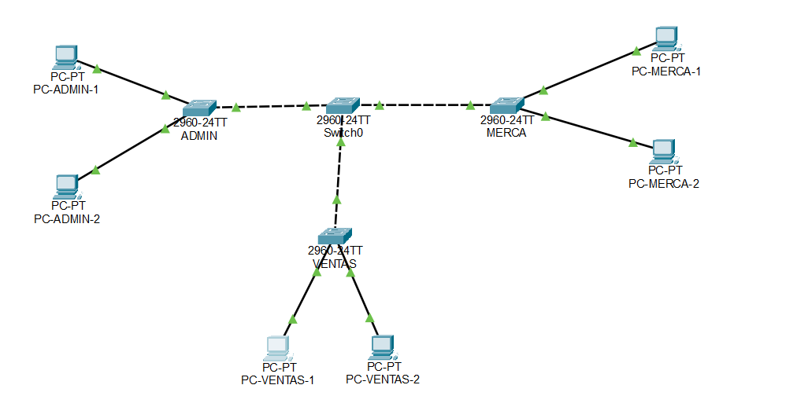

Todos los indicadores de los enlaces aparecen en color verde, lo cual confirma que las conexiones físicas se encuentran activas.

### 4.1 Distribución de conexiones

| Dispositivo de origen | Puerto | Dispositivo de destino | Puerto | Tipo de enlace |
|---|---|---|---|---|
| Switch0 | Fa0/1 | ADMIN | Fa0/1 | Trunk |
| Switch0 | Fa0/2 | MERCA | Fa0/1 | Trunk |
| Switch0 | Fa0/3 | VENTAS | Fa0/1 | Trunk |
| ADMIN | Fa0/2 | PC-ADMIN-1 | FastEthernet0 | Access VLAN 10 |
| ADMIN | Fa0/3 | PC-ADMIN-2 | FastEthernet0 | Access VLAN 10 |
| MERCA | Fa0/2 | PC-MERCA-1 | FastEthernet0 | Access VLAN 20 |
| MERCA | Fa0/3 | PC-MERCA-2 | FastEthernet0 | Access VLAN 20 |
| VENTAS | Fa0/2 | PC-VENTAS-1 | FastEthernet0 | Access VLAN 30 |
| VENTAS | Fa0/3 | PC-VENTAS-2 | FastEthernet0 | Access VLAN 30 |

### 4.2 Estado de los puertos de Switch0

La siguiente evidencia muestra activos los puertos FastEthernet0/1, FastEthernet0/2 y FastEthernet0/3 del switch central. Estos puertos corresponden a los enlaces hacia ADMIN, MERCA y VENTAS.

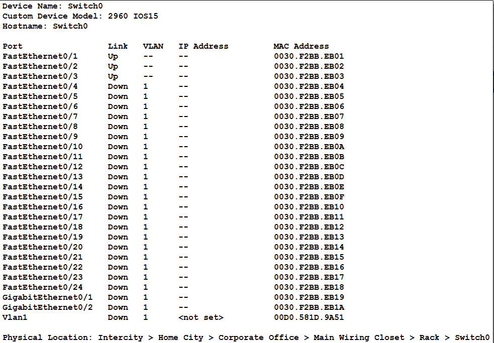

## 5. Diseño lógico de la red

### 5.1 VLAN configuradas

| ID de VLAN | Nombre | Departamento | Red IPv4 | Máscara |
|---:|---|---|---|---|
| 10 | ADMIN | Administración | 192.168.10.0/24 | 255.255.255.0 |
| 20 | MERCA | Mercadeo | 192.168.20.0/24 | 255.255.255.0 |
| 30 | VENTAS | Ventas | 192.168.30.0/24 | 255.255.255.0 |

### 5.2 Direccionamiento de las computadoras

| Dispositivo | VLAN | Dirección IPv4 | Máscara | Gateway |
|---|---:|---|---|---|
| PC-ADMIN-1 | 10 | 192.168.10.10 | 255.255.255.0 | No configurado |
| PC-ADMIN-2 | 10 | 192.168.10.11 | 255.255.255.0 | No configurado |
| PC-MERCA-1 | 20 | 192.168.20.10 | 255.255.255.0 | No configurado |
| PC-MERCA-2 | 20 | 192.168.20.11 | 255.255.255.0 | No configurado |
| PC-VENTAS-1 | 30 | 192.168.30.10 | 255.255.255.0 | No configurado |
| PC-VENTAS-2 | 30 | 192.168.30.11 | 255.255.255.0 | No configurado |

No se configuró puerta de enlace predeterminada porque la actividad no incluye un router ni un switch multicapa. Por esta razón, únicamente debe existir comunicación dentro de cada VLAN.

## 6. Configuración de VTP

Todos los switches utilizan el dominio VTP `REDES1` y la versión 2. Los modos de operación son los siguientes:

| Switch | Modo VTP | Comportamiento |
|---|---|---|
| Switch0 | Server | Crea las VLAN y distribuye la base de datos VTP |
| ADMIN | Client | Aprende las VLAN anunciadas por Switch0 |
| MERCA | Client | Aprende las VLAN anunciadas por Switch0 |
| VENTAS | Transparent | No sincroniza su base de VLAN; las VLAN se crean localmente |

El número de revisión VTP no se asigna manualmente. Switch0 lo incrementa cuando se modifica la base de VLAN y los switches cliente se sincronizan automáticamente. El switch transparente puede conservar una revisión diferente, normalmente cero.

## 7. Scripts de configuración

### 7.1 Switch0 - Servidor VTP

```cisco
enable
configure terminal
hostname Switch0

vtp domain REDES1
vtp mode server
vtp version 2

vlan 10
 name ADMIN
exit
vlan 20
 name MERCA
exit
vlan 30
 name VENTAS
exit

interface range fastEthernet 0/1 - 3
 switchport mode trunk
 switchport trunk allowed vlan 10,20,30
 no shutdown
exit

end
copy running-config startup-config
```

Comandos de verificación:

```cisco
show vtp status
show vlan brief
show interfaces trunk
```

### 7.2 Switch ADMIN - Cliente VTP

```cisco
enable
configure terminal
hostname ADMIN

vtp domain REDES1
vtp mode client
vtp version 2

interface fastEthernet 0/1
 switchport mode trunk
 switchport trunk allowed vlan 10,20,30
 no shutdown
exit

interface range fastEthernet 0/2 - 3
 switchport mode access
 switchport access vlan 10
 spanning-tree portfast
 no shutdown
exit

end
copy running-config startup-config
```

Comandos de verificación:

```cisco
show vtp status
show vlan brief
show interfaces trunk
```

### 7.3 Switch MERCA - Cliente VTP

```cisco
enable
configure terminal
hostname MERCA

vtp domain REDES1
vtp mode client
vtp version 2

interface fastEthernet 0/1
 switchport mode trunk
 switchport trunk allowed vlan 10,20,30
 no shutdown
exit

interface range fastEthernet 0/2 - 3
 switchport mode access
 switchport access vlan 20
 spanning-tree portfast
 no shutdown
exit

end
copy running-config startup-config
```

Comandos de verificación:

```cisco
show vtp status
show vlan brief
show interfaces trunk
```

### 7.4 Switch VENTAS - VTP transparente

```cisco
enable
configure terminal
hostname VENTAS

vtp domain REDES1
vtp mode transparent
vtp version 2

vlan 10
 name ADMIN
exit
vlan 20
 name MERCA
exit
vlan 30
 name VENTAS
exit

interface fastEthernet 0/1
 switchport mode trunk
 switchport trunk allowed vlan 10,20,30
 no shutdown
exit

interface range fastEthernet 0/2 - 3
 switchport mode access
 switchport access vlan 30
 spanning-tree portfast
 no shutdown
exit

end
copy running-config startup-config
```

Comandos de verificación:

```cisco
show vtp status
show vlan brief
show interfaces trunk
```

## 8. Verificación de VTP y VLAN

### 8.1 Switch0

El resultado de `show vtp status` debe identificar a Switch0 como servidor del dominio `REDES1`. El comando `show vlan brief` debe mostrar las VLAN 10, 20 y 30 con los nombres ADMIN, MERCA y VENTAS.

> 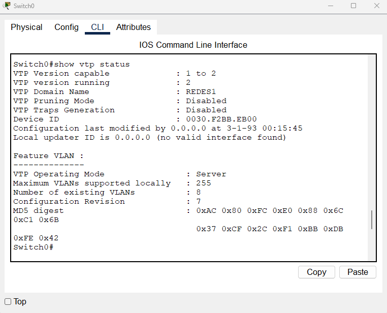

> 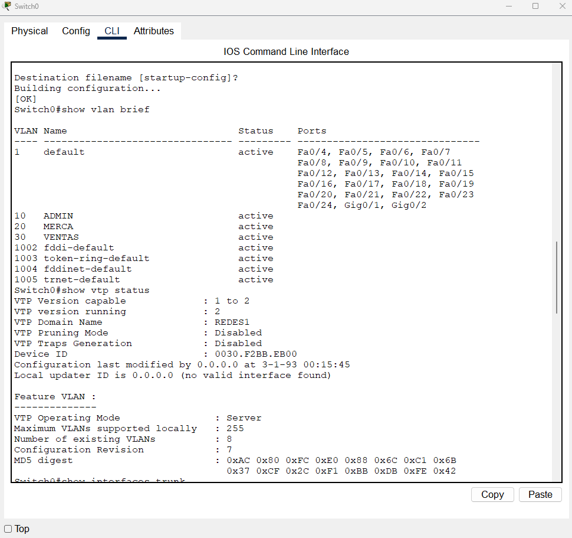

### 8.2 Switch ADMIN

El resultado debe identificar al switch como cliente VTP. Las VLAN 10, 20 y 30 deben aparecer como VLAN aprendidas, y los puertos Fa0/2 y Fa0/3 deben estar asignados a ADMIN.

> 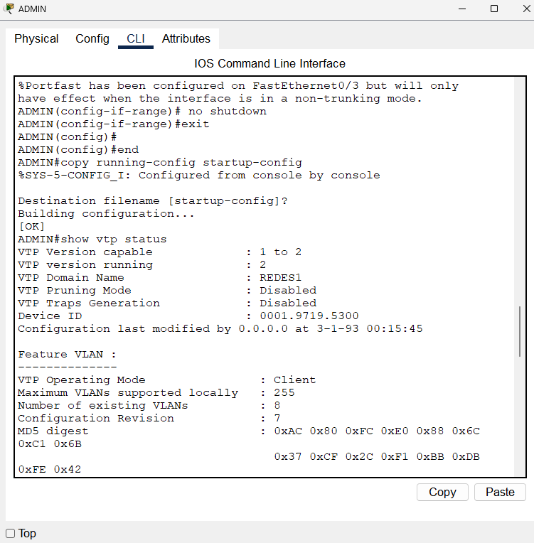

> 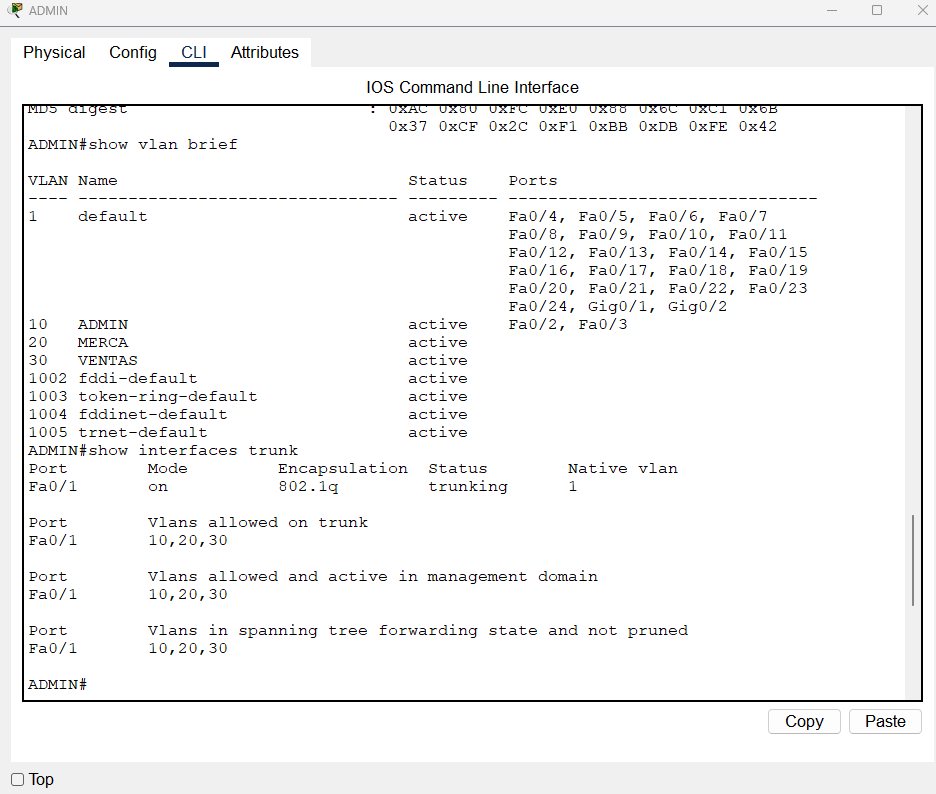

### 8.3 Switch MERCA

El resultado debe identificar al switch como cliente VTP. Las VLAN deben haber sido propagadas desde Switch0, y los puertos Fa0/2 y Fa0/3 deben aparecer dentro de MERCA.

> 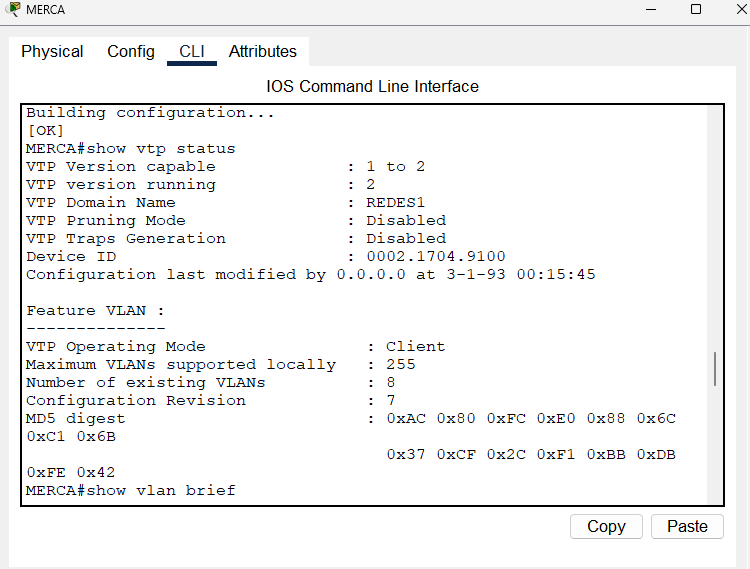

> 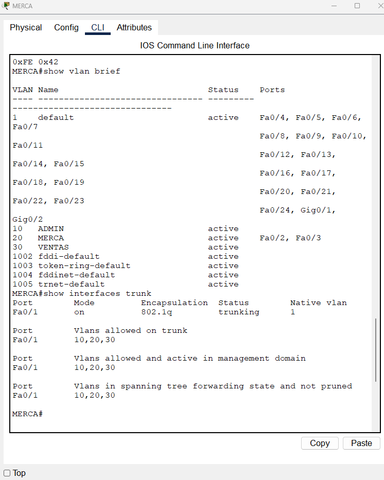

### 8.4 Switch VENTAS

El resultado debe identificar al switch en modo transparente. Las VLAN se encuentran disponibles porque fueron creadas localmente, y los puertos Fa0/2 y Fa0/3 deben estar asignados a VENTAS.

>  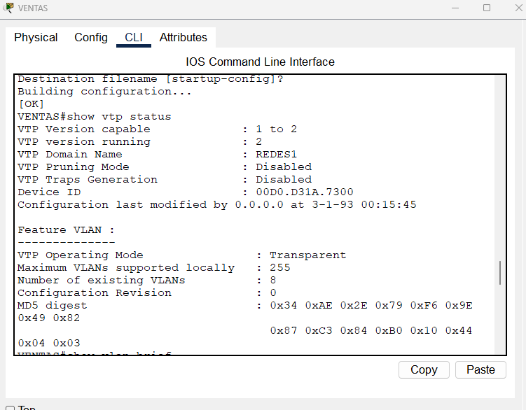

> 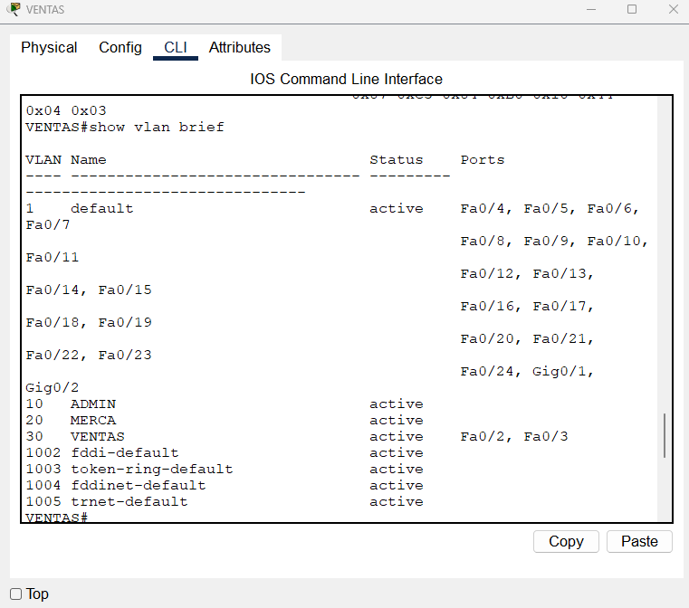

## 9. Pruebas de conectividad

### 9.1 Ping exitoso dentro de la VLAN ADMIN

Desde PC-ADMIN-1 se ejecutó el siguiente comando para comprobar la comunicación con PC-ADMIN-2:

```text
ping 192.168.10.11
```

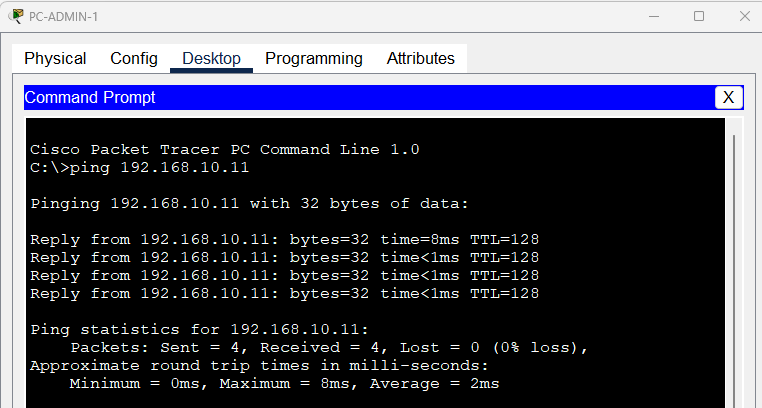

El resultado muestra cuatro paquetes enviados y cuatro recibidos, con 0 % de pérdida. Esto confirma que ambos equipos pertenecen a la VLAN 10, utilizan direcciones de la misma red y tienen conectividad de capa 2.

### 9.2 Ping fallido entre VLAN diferentes

Desde PC-ADMIN-1 se realizaron pruebas hacia un equipo de MERCA y un equipo de VENTAS:

```text
ping 192.168.20.10
ping 192.168.30.10
```

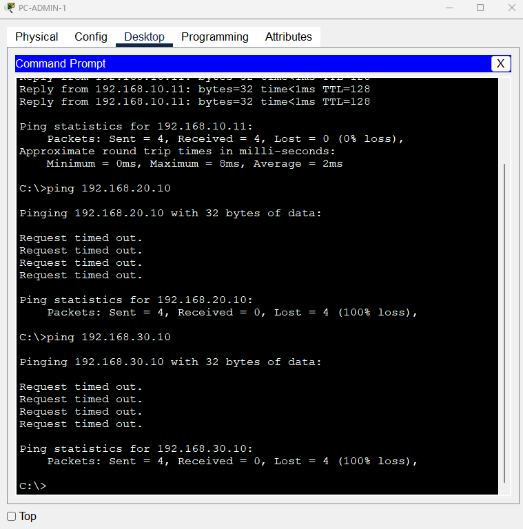

Las dos pruebas presentan cuatro paquetes enviados, cero recibidos y 100 % de pérdida. El comportamiento es correcto porque las VLAN 10, 20 y 30 representan dominios de broadcast separados y no existe enrutamiento inter-VLAN.

### 9.3 Resumen de resultados

| Origen | Destino | Relación | Resultado esperado | Resultado obtenido |
|---|---|---|---|---|
| PC-ADMIN-1 | PC-ADMIN-2 | Misma VLAN 10 | Exitoso | Exitoso, 0 % de pérdida |
| PC-ADMIN-1 | PC-MERCA-1 | VLAN 10 a VLAN 20 | Fallido | Fallido, 100 % de pérdida |
| PC-ADMIN-1 | PC-VENTAS-1 | VLAN 10 a VLAN 30 | Fallido | Fallido, 100 % de pérdida |

## 10. Análisis de resultados

La propagación mediante VTP permite administrar las VLAN desde Switch0 y evita tener que crearlas manualmente en los switches cliente ADMIN y MERCA. En contraste, VENTAS funciona de manera independiente porque se configuró en modo transparente, por lo que su base local de VLAN debe administrarse directamente.

Los enlaces trunk transportan tráfico etiquetado de las VLAN 10, 20 y 30 entre el switch central y los switches de acceso. Los puertos conectados a las computadoras se configuraron en modo access y pertenecen únicamente a la VLAN de su departamento.

Las pruebas de conectividad confirman el aislamiento lógico de la red. Los equipos dentro de ADMIN pueden comunicarse, mientras que las comunicaciones hacia MERCA y VENTAS son bloqueadas por la separación de VLAN y por la ausencia de un dispositivo de capa 3.

## 11. Conclusiones

- Se construyó correctamente una topología con un switch central y tres switches de acceso.
- Las VLAN 10, 20 y 30 permiten separar el tráfico de ADMIN, MERCA y VENTAS.
- VTP propagó la base de VLAN desde Switch0 hacia los switches cliente ADMIN y MERCA.
- El modo transparente de VENTAS permitió conservar una configuración local de VLAN.
- Los enlaces trunk transportan las VLAN autorizadas entre los switches.
- El ping exitoso dentro de ADMIN confirma la conectividad entre equipos de la misma VLAN.
- Los pings fallidos hacia MERCA y VENTAS confirman el aislamiento entre VLAN diferentes.
- Para permitir comunicación entre las VLAN sería necesario agregar enrutamiento inter-VLAN mediante un router o un switch multicapa.


